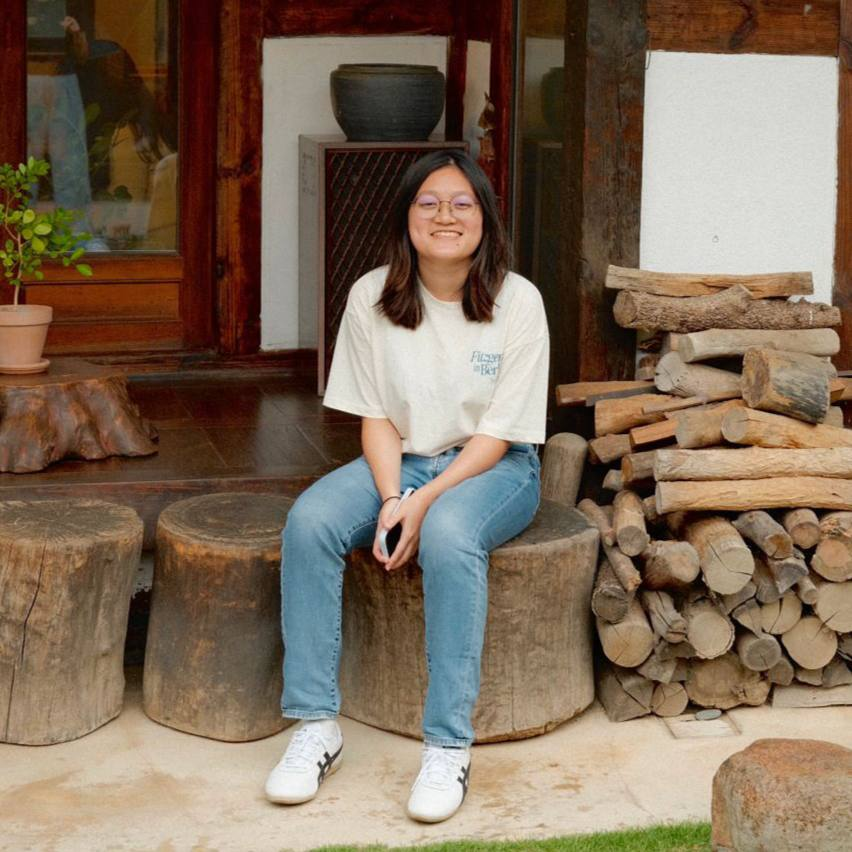
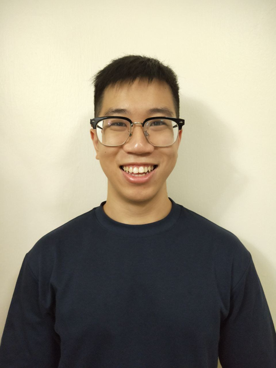
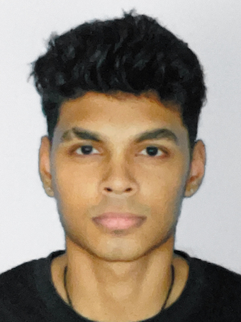

We are a team based in the [School of Computing, National University of Singapore](http://www.comp.nus.edu.sg).

You can reach us at the email `seer[at]comp.nus.edu.sg`

## Project team

### Woo Jia Hao

[[homepage](https://woojiahao.com/)]
[[github](https://github.com/woojiahao)]
[[portfolio](team/woojiahao.md)]

* Role: Integrations

### Jamie Toh

[[github](http://github.com/jamz903)]
[[portfolio](team/jamz903.md)]

* Role: Developer
* Responsibilities: Testing

### Tan Lip Wei

[[github](http://github.com/lipwei1808)] [[portfolio](team/lipwei1808.md)]

* Role: Developer
* Responsibilities: Model

### Ernest Liu

[[github](http://github.com/elhy1999)]
[[portfolio](team/elhy1999.md)]

* Role: Developer
* Responsibilities: Documentations

### Rubesh Suresh

[[github](http://github.com/sp4ce-cowboy)]
[[portfolio](team/sp4ce-cowboy.md))]

* Role: Developer
* Responsibilities: Storage
