**Team:** T16-03

**Name:** UniCa$h

**User Target Profile:** Our application is for university students who want to be more financially conscious about their spending habits, enabling them to make wiser economic decisions, providing students on a limited budget with more purchasing power.

**Value Proposition:** It provides university students with an intuitive and frictionless experience to have transparency on their expenditure to help them better understand their expenditure so they can develop better financial habits as they transition into adulthood.



## Getting Started

### Setting up

If you are interested in testing out UniCa$h, you can refer to our [quick start](UserGuide.html#quick-start) in the user guide.

If you are interested in developing for UniCa$h, we recommend setting it up locally.

First, ensure that the project is set up locally:

1. Create a fork of the GitHub repository
2. Clone the fork of the repository
3. Change to the fork local directory
4. Build the project
5. Run the project

Then, to contribute to the project, we recommend the following flow:

1. Create a feature/fix/improvement local branch
2. Make the changes necessary
3. Create a Pull Request to the original repository

### Acknowledgements

This project is based on the AddressBook-Level3 project created by the [SE-EDU initiative](https://se-education.org).

[//]: # (### 3.2. Setting up)

[//]: # ()
[//]: # ()
[//]: # (### 3.3. Using this Developer Guide)

[//]: # ()
[//]: # ()
[//]: # (### 3.4. Other useful guides)

[//]: # ()
[//]: # (Here is some other useful information.)

[//]: # ()
[//]: # (#### 3.4.1. User Guide)

[//]: # ()
[//]: # (#### 3.4.2. Documentation Guide)

[//]: # ()
[//]: # (#### 3.4.3. Testing & Logging Guide)

[//]: # ()
[//]: # (#### 3.4.4. Configuration & DevOps)

### Terminology

| Term        | Meaning                                                                                           |
|-------------|---------------------------------------------------------------------------------------------------|
| Transaction | Represents both an expense or an income. Expenses cause a net loss while incomes cause a net gain |

---

## Feature Tracking

Every user can...

- Track and manage their expenses
- Manage a budget
- View their total expenditure by the month/year
- Visualise their spending habits

### Development Milestones

Features were developed over two sprints, each sprint lasting two weeks.

#### Milestone v1.2

##### Track Finances

[//]: # (TODO: Link to each DG/UG entry)

- Add transaction
- Delete transaction
- Clear all transaction
- Edit transaction
- Find transaction(s)
- Get total expenditure
 
##### Categorize Finances

This feature serves as an extension to adding a transaction as categories provide finer details about a transaction.

Using the `edit_transaction` command, users can now:

- Add categories
- Edit existing categories
- Remove existing categories

##### Others

- Support file storage of transactions
- Remove all dependencies to original AB3
- Clean up package structure
- Configure Gradle + Github Actions for UI testing and coverage reporting

#### Milestone v1.3

- Support multi-format date time strings
- Expand search functionality of `find` command
- Add year support when retrieving total expenditure
- Summary visualizations for expenses
- UI improvements
- Support file storage of budget

## Requirements

### Non-Functional Requirements

1. The application should be cross-platform functional on major operating systems, i.e. Windows, MacOS, Linux, running at least Java 11
2. All transactions and budget managed by the user should be saved and backed up locally and restored the next session as long as the data has not been corrupted
3. The user guide should be clear and straightforward so that the user can perform all major tasks intuitively
4. All non-private methods should be well-documented to ensure that the codebase is maintainable
5. The application should have an intuitive interface with easy navigation commands and clear instructions/errors
6. The application achieves at least 85% in test coverage with comprehensive unit and integration tests
7. The user should not experience excessive sluggishness while using the application
8. The application should serve the latest updates of transactions the moment these updates are confirmed
9. The application should not require an active Internet connection to function
10. The application should be able to generate visualisations for 1000 expenses without any excessive sluggishness

[//]: # (### Product Scope)

[//]: # ()
[//]: # (### User Stories)

### Use Cases
The following documents use cases for our application

For the following Use Cases (unless specified otherwise):
- The System is `UniCa$h`
- The Actor is `User`

**Use Case: UC01 - Adding a Transaction**

**MSS:**
1. User enters the command to add a transaction with the correct format.
2. User submits the request.
3. UniCa$h adds the transaction to the transactions list and displays success message.
    
    Use Case ends

**Extensions**
- 2a. User enters an incorrect format
  - 2a1. UniCa$h displays an error message with the correct command format.
  - Use case resumes at step 1.
- 2b. User enters an extremely high number
  - 2b1. UniCa$h prompts the user with a warning of the input
  - 2b2. User confirms the request
  - Use case resumes at step 3.

**Use Case: UC02 - Finding a Transaction**

**MSS:**
1. User enters the command to find a transaction with the correct format.
2. User submits the request.
3. UniCa$h filters all the transactions based on the specified filters and returns
the filtered transaction with a success message.

   Use Case ends

**Extensions**
- 2a. User enters an incorrect format.
  - 1a1. UniCa$h displays an error message with the correct command format.
  - Use case resumes at step 1.

- 3a. UniCa$h does not find any results matching the filter.
  - 3a1. UniCa$h displays a message saying no results found.
  - Use Case resumes at step 1

**Use Case: UC03 - Delete a Transaction**

**MSS:**
1. User enters the command to delete a transaction with the correct format.
2. User submits the request.
3. UniCa$h finds the transaction based on the passed in arguments.
4. UniCa$h deletes the transaction.
5. UniCa$h displays success message.

   Use Case ends

**Extensions**
- 2a. User enters an incorrect format.
    - 2a1. UniCa$h displays an error message with the correct command format.
    - Use case resumes at step 1.

- 3a. UniCa$h does not find any transactions matching the provided arguments.
    - 3a1. UniCa$h displays a message saying no results found.
    - Use Case resumes at step 1

**Use Case: UC04 - Editing a Transaction**

**MSS:**
1. User enters the command to edit an existing transaction's fields in the correct format.
2. User submits the request.
3. UniCa$h makes the edits specified in the command and displays all the fields of that transaction.

   Use Case ends.

**Extensions**
- 2a. User provides a field in an incorrect format. (e.g. amount is not expressed as a float, name is empty,
  unrecognized datetime format, etc.)
    - 2a1. UniCa$h displays an error message that requests for correct format.
    - Use case resumes at step 1.

- 2b. User requests to edit a transaction that does not exist
    - 2b1. UniCa$h displays an error message informing the user that the transaction cannot be found.
    - Use case resumes at step 1.

- 2c. User does not specify which field of a transaction to edit
    - 2c1. UniCa$h displays an error message and displays the correct way to format the edit command.
    - Use case resumes at step 1.


**Use Case: UC05 - Listing all Transactions**

**MSS:**
1. User enters the command to list all transactions with the correct format (i.e. no parameters).
2. User submits the request.
3. UniCa$h retrieves the list of all transactions and displays them for the User.

   Use Case ends.

**Extensions**
- 2a. User enters the command with the incorrect format (i.e. with parameters).
    - 2a1. UniCa$h displays an error message, requests for the correct format.
    - Use case resumes from step 1.

- 3a. There are no transactions for UniCa$h to retrieve.
    - 3a1. UniCa$h displays no transactions, and informs the user that all transactions have been retrieved. 
    - Use Case ends.

**Use Case: UC06 - Finding a Transaction**

**MSS:**
1. User enters the command to find transaction with the correct format.
2. User submits the request.
3. UniCa$h filters the transactions based on the specified filters and returns the filtered list of expenses with a success message.

   Use Case ends.

**Extensions**
- 2a. User enters an incorrect format.
    - 2a1. UniCa$h displays an error message, requests for correct format.
    - 2a2. User enters command with new format.
    Steps 2a1-2a2 are repeated until the format entered is correct.

    Use case resumes from Step 3.

- 3a. UniCa$h does not find any results matching the filter.
    - 3a1. UniCa$h displays a message informing the user that no results were found.
    - Use Case ends.

**Use Case: UC07 - Tabulate Total Expenditure**

**MSS:**
1. User enters the command to tabulate total expenditure.
2. User submits the request.
3. UniCa$h tabulates the expenditure based on the parameters passed in.
4. UniCa$h displays the tabulated expenditure.

   Use Case ends.

**Extensions**
- 2a. User detects an issue with the command entered.
    - 2a1. UniCa$h displays an error message, requests for command to be re-entered.
    - 2a2. User enters command again.

  Steps 2a1-2a2 are repeated until the command entered is correct.

  Use case resumes from Step 3.

**Use Case: UC08 - Clear All Transactions**

**MSS:**
1. User enters the command to clear all transactions with the correct format. (i.e. no parameters)
2. User submits the request.
3. UniCa$h deletes all transactions in the transactions list.
4. UniCa$h displays success message.

   Use Case ends

**Extensions**
- 2a. User enters an incorrect format.
  - 2a1. UniCa$h displays an error message with the correct command format.
  - Use case resumes at step 1.

- 3a. UniCa$h finds an empty transactions list.
  - 3a1. UniCa$h displays a message saying that transactions list is empty.
  - Use Case resumes at step 1

**Use Case: UC09 - Show Summary Statistics**

**MSS:**
1. User enters the command to get the summary for their expenses.
2. User submits the request.
3. UniCa$h summarizes the user's saved expenses by month and by category.
4. UniCa$h displays summary plots for the user to analyze their expenses.

   Use Case ends.

**Extensions:**

- 2a. UniCa$h does not contain any of the user's expenses.
    - 2a1. UniCa$h displays a prompt informing the user that there are no expenses available.
    - Use case ends.

**Use Case: UC10 - Show UniCa$h Help**

**MSS:**
1. User enters the command to show help with the correct format. (i.e. no parameters)
2. User submits the request.
3. UniCa$h displays help message in the help window.

   Use Case ends

**Extensions**
- 2a. User enters an incorrect format.
  - 2a1. UniCa$h displays an error message with the correct command format.
  - Use case resumes at step 1.

**Use Case: UC11 - Exit UniCa$h**

**MSS:**
1. User enters the command to exit UniCa$h with the correct format (i.e. no parameters)
2. User submits the request. 
3. UniCa$h displays exit message and application closes

   Use Case ends

**Extensions**
- 2a. User enters an incorrect format.
  - 2a1. UniCa$h displays an error message with the correct command format.
  - Use case resumes at step 1.

**Use Case: UC12 - Set Budget**

**MSS:**
1. User enters the command to set the budget with the correct format (i.e. specifying the amount and interval).
2. User submits the request.
3. UniCa$h sets the global budget.
4. UniCa$h displays the new budget.

   Use Case ends.

**Extensions:**

- 1a. User enters the incorrect format (missing fields)
  - 1a1. UniCa$h displays an error message with the correct command format
  - Use case resumes at step 1.
- 3a. UniCa$h contains existing budget.
  - 3a1. UniCa$h replaces existing budget with new one.
  - Use case resumes at step 4.

**Use Case: UC13 - Clear Budget**

**MSS:**
1. User enters the command to clear the budget.
2. User submits the request.
3. UniCa$h clears the existing budget.
4. UniCa$h displays a success message.

   Use Case ends.

**Extensions:**

- 3a. UniCa$h does not contain an existing budget.
    - 3a1. UniCa$h displays a prompt to create a budget first.
    - Use case ends.

**Use Case: UC14 - Get Budget**

**MSS:**
1. User enters the command to get the budget.
2. User submits the request.
3. UniCa$h tabulates the expenditure relative to the budget set for the given interval.
4. UniCa$h displays the budget and the net amount of the budget.

   Use Case ends.

**Extensions:**

- 3a. UniCa$h does not contain an existing budget.
    - 3a1. UniCa$h displays a prompt to create a budget first.
    - Use case ends.

---

## Design Overview

### Architecture

### UI Component

UniCa$h is a Graphical User Interface (GUI) application, built using JavaFX. The following section describes the
implementation of the various UI components in UniCa$h.

#### UI Components
UniCa$sh consists of the following UI components:
1. Main Window
2. Help Window
3. Statistics / Budget Window


In this section, we will be going through the implementation of the main window.

#### Main Window Design
The main window consists of three components: the command input box, as well as two panes,
the transaction list pane and the command results pane.

For the command input box, we have a custom `CommandBox` class that extends `TextField` to provide
the user with the ability to type their commands into the application.

For the transaction list pane, we have a custom `TransactionListPanel` class that is a `ListView` to
provide the user with a scrollable list of transactions. This view is updated whenever the user executes
commands that modify the transaction list. (i.e. `add`, `delete`, `edit`, `clear`)

For the command results pane, we have a custom `ResultDisplay` class. This pane displays the results of the
user's command execution. This view is updated whenever the user executes commands that modify the transaction.
Error messages are also displayed here, such as when the user enters an invalid command.

#### Main Window Implementation
The main window for UniCa$h is implemented using the `MainWindow` class. This class is made up of:
1. `CommandBox`: The command input box
2. `TransactionListPanel`: The transaction list pane
3. `ResultDisplay`: The command results pane

All these components, including the `MainWindow`, inherit from the abstract `UiPart` class which provides
the basic functionality of a UI component, such as the ability to set the root node of the component.

The `UI` component uses the JavaFx UI framework to render the UI components. The layout of these parts are defined
in the matching .fxml files that are located in `src/main/resources/view` folder. (e.g. The layout of the
TransactionCard is specified in`TransactionCard.fxml`)

The `UI` component is also responsible for:
- executing commands using the `Logic` component, through the `executeCommand` method
- listening for changes to the `Model` component, through the `listenToModelChanges` method

### Logic Component

### Model Component

### Storage Component

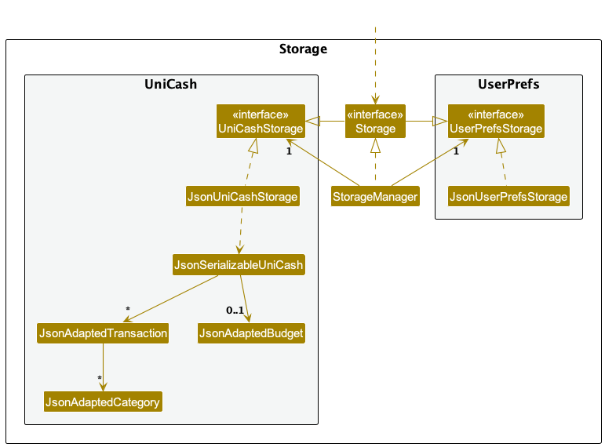

UniCa$h stores any persistent data as local [JSON files](https://www.json.org/json-en.html), located in the same folder where the JAR file is run.

The following are the files that are created:

- `config.json`
- `preferences.json`
- `data/unicash.json`

[Jackson](https://github.com/FasterXML/jackson) is used for JSON (de)serialization and it relies on adapted models similar to the [Data Transfer Object pattern.](https://www.baeldung.com/java-dto-pattern)


#### Malformed JSONs

<div class="callout callout-important" markdown="span" style="margin-bottom: 20px;">
If a JSON file is malformed, the contents will not be loaded and a log message will be printed. 
<br><br>
However, no proactive measures are applied to rectify the issue such as automatically deleting the file or fixing the error to avoid prescribing a fixed approach to resolving malformed JSONs.
</div>

While we do not make assumptions about the intended action when encountering a malformed JSON file, most JSON files will be overwritten at some point, so the malformed JSON should eventually be overwritten with proper JSON.

For `data/unicash.json`, this occurs when adding, editing, or deleting the transaction list or updating the budget.

For `config.json` and `preferences.json`, this occurs in the `MainApp#initConfig` and `MainApp#initPrefs` methods.

### Continuous Integration (CI)

Continuous integration consists of the following:

1. General unit testing
2. UI testing
3. Automated testing on Github
4. Code coverage reporting

<div class="callout callout-info" markdown="span">
**[Github Actions](https://docs.github.com/en/actions) Primer**
<br><br>
Github Actions is used to execute a set of behavior on a repository and is often used for Continuous Integration and Continuous Deployment.
<br><br>
Github Actions are created as YAML configuration files found in the `.github/workflows` folder.
<br><br>
GitHub Actions can be generally broken down into the following components:
<br>
1. Trigger: dictates when the action is run
<br>
2. Strategy & matrix: specifies the platform (OS) and any relevant versions to run the steps
<br>
3. Steps: consists of individual steps that can use other Github Actions to perform a set of actions in sequential order
</div>

#### General unit testing

General unit tests cover any non-UI related aspect of UniCa$h such as models, commands, and utility.

[JUnit 5](https://junit.org/junit5/), along with custom-built assertion methods like `CommandTestUtil#assertCommandSuccess`, are used to perform general unit testing.

#### UI testing

UI testing helps automate some manual testing by simulating user interaction with the UI, ensuring that the UI is responding as intended.

[JUnit 5](https://junit.org/junit5/) and [TestFX](https://github.com/TestFX/TestFX) are used to setup and perform UI testing.

To initialize a test class to work with TestFX, annotate it with the following:

```java
@ExtendWith(ApplicationExtension.class)
public class HelpWindowUiTest {
```

This leverages [JUnit 5's built-in extensions system](https://junit.org/junit5/docs/current/user-guide/#extensions) to
inject an `FxRobot` argument in each unit test. 

<div class="callout callout-info" markdown="span" style="margin-bottom: 20px;">
`FxRobot` is used as a driver to perform UI operations on the running UI, such as performing clicks, entering text, and performing keyboard inputs, along with searching for UI elements by `fx:id`.
</div>

```java
@Test
public void userInput_help_showHelpWindowAsRoot(FxRobot robot) throws TimeoutException {
    // Search for elements in the UI
    var beforeHelpContainer = robot.lookup("#helpMessageContainer").tryQuery();
    
    assertTrue(beforeHelpContainer.isEmpty());
    // Perform a mouse click
    robot.clickOn("#commandBoxPlaceholder");
    
    // Enter text input
    robot.write("help");
    
    // Perform a keyboard input
    robot.press(KeyCode.ENTER);
    
    var afterHelp = robot.lookup("#helpMessageContainer").tryQuery();
    assertTrue(afterHelp.isPresent());
}
```

Furthermore, there are two methods of initializing the UI for testing, the first using the `@Start` annotation and the other uses the `@BeforeEach` annotation.

##### Using `@Start`

<div class="callout callout-info" markdown="span" style="margin-bottom: 20px;">
Use `@Start` when testing individual UI components.
</div>

When defining a `@Start` method, a `Stage` is injected through
the [test runner](https://junit.org/junit5/docs/current/user-guide/#writing-tests-dependency-injection) and this
allows you to initialize a new `Stage` with custom UI components.

This is especially useful when working with individual UI components like `HelpWindow` and `TransactionCard` as it
provides a medium to render these elements without running the entire UI.

```java
@Start
public void start(Stage stage) {
    // helpWindow is declared outside of the method to be accessed in all unit tests
    helpWindow = new HelpWindow(stage);
    stage.show();
}
```

<div class="callout callout-info" markdown="span">
The `@Start` method is run before each test case.
</div>

##### Using `@BeforeEach`

<div class="callout callout-info" markdown="span" style="margin-bottom: 20px;">
Use `@BeforeEach` when testing the entire UI, i.e. integration testing.
</div>

When performing a general set of integration tests across the entire UI (like simulating user input to execution to
view the resulting UI changes), it is best to define a `@BeforeEach` method that uses `FxToolkit` to setup
the application (in this case, `MainApp`) with any given setup parameters like a default storage location.

<div class="callout callout-important" markdown="span" style="margin-bottom: 20px;">
When testing the entire application, a temporary storage file should be defined and provided for `MainApp` to avoid directly modifying the save data on your local machine.
</div>

```java
@TempDir
Path tempDir;

@BeforeEach
public void runAppToTests() throws TimeoutException {
    FxToolkit.registerPrimaryStage();
    FxToolkit.setupApplication(() -> new MainApp(tempDir.resolve("ui_data.json")));
    FxToolkit.showStage();
    WaitForAsyncUtils.waitForFxEvents(20);
}
```

<div class="callout callout-info" markdown="span" style="margin-bottom: 20px;">
The `@BeforeEach` method is run before each test case.
</div>

It is also good convention to include an `@AfterEach` method to clean up the stages created during `@BeforeEach` so
that all resources are freed after every unit test:

```java
@AfterEach
public void stopApp() throws TimeoutException{
    FxToolkit.cleanupStages();
}
```

#### Automated testing on Github

Automated testing is achieved via the `.github/workflows/unit_test.yml` action.

Automated testing is triggered on every push and pull request and is run across all three major OSes: Ubuntu, MacOS, and Windows, and comprise of the following steps:


<div class="callout callout-important" markdown="span" style="margin-bottom: 20px;">
UI tests are only run on Windows as both Linux and MacOS requires headless UI testing which is not well supported with Github Actions.
</div>

#### Code coverage reporting

Code coverage is generated using Github Actions and Gradle and uploaded to [Codecov.](https://app.codecov.io/gh/AY2324S1-CS2103-T16-3)

Code coverage includes both general unit tests and UI tests, and reporting is achieved through the `.github/workflows/gradle.yml` action.

Similar to automated testing, code coverage reporting is triggered on every push and pull request and is run across all three major OSes.

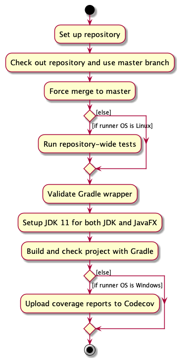

To ensure that code coverage reporting includes both general unit tests and UI tests, the following changes have been made to `build.gradle`:

1. A new Gradle task `uiTest` was created to only run UI tests that are unit test files that end with `UiTest`
2. The default `test` task is configured to exclude such files
3. The `jacocoTestReport` task is modified to only depend on (i.e. run before) the `uiTest` task is the system's OS is not MacOS, Ubuntu or *nux (i.e. Windows only)
4. The `coverage` task includes every `*.exec` file generated from both `uiTest` and `test` so that both coverage reports are available to Codecov

The Github Action for reporting the code coverage only uploads the coverage reports to Codecov if the runner is Windows as only then will there be a complete code coverage report.

These changes work around the limitation of Linux and MacOS runners on Github Actions not supporting a headless environment.

By introducing UI testing into the code coverage reporting, we have been able to achieve a code coverage of > 85%!

### General Classes and Components

#### StyleSheet

#### Command Usage Message Builder

Uniformly generates `MESSAGE_USAGE` strings to be used per command. Works well with `ExampleGenerator` to create consistent examples for every command using each type of prefix. Reduces the overhead of ensuring that all example values are accurate or ensuring that formatting for command usage is uniform.

Relies heavily on the [builder design pattern.](https://refactoring.guru/design-patterns/builder)

Example usage of `CommandUsage` would be:

```java
private static final MESSAGE_USAGE = new CommandUsage.Builder()
    .setCommandWord("set_budget")
    .setDescription("Sets the user's budget on UniCa$h.")
    .addParameter(PREFIX_AMOUNT, "Amount")
    .addParameter(PREFIX_INTERVAL, "Interval") 
    .setExample(
        ExampleGenerator.generate(
            "set_budget", 
            PREFIX_AMOUNT, 
            PREFIX_INTERVAL
        )
    ) 
    .build()
    .toString();
```

---

## Features & Implementation

UniCa$h comprises four key components:

1. Transaction Management
2. Budget Management
3. General Utility
4. User Interface

### Transaction Management

#### Transaction Model

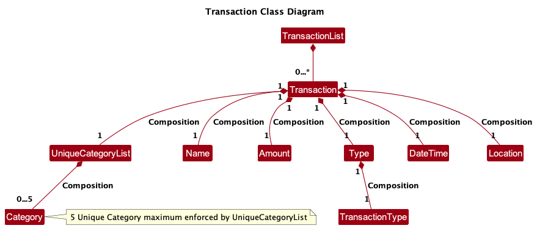

UniCa$h tracks transactions with the use of `TransactionList` and `Transaction`. `TransactionList` acts
as a wrapper for a list of `Transaction` that enforces no `null`. `TransactionList` does not enforce any equality
constraints, thus any forms of duplicated `Transaction` are allowed to be stored. This was an intentional decision, 
as we want to allow users to record recurring transactions.

The `Transaction` class is composed of the following fields

1. `Name`: The name of the transaction.
2. `Type`: The transaction type of the transaction. UniCash supports expense and income only.
   1. `TransactionType`: An enum comprising of the values `income` and `expense`.
3. `Amount`: The monetary value of the transaction.
4. `DateTime`: The date and time of the transaction to be recorded.
5. `Location`: The location where the transaction took place.
6. `UniqueCategoryList`: A list of categories to be tagged with the transaction.
   1. `Category`: The name of a category tagged to a transaction.

The following are some noteworthy points regarding the attributes
1. There are 3 compulsory fields, namely `Name`, `Type` and `Amount`. The remaining fields would fall back to a default value if not specified.
2. There is a character limit for `Name` and `Location` set at up to 500 characters.
3. `Amount` entered has to be positive for both `income` and `expense`.
4. `Amount` is automatically rounded to 2 decimal places.
5. `UniqueCategoryList` enforces a unique (case-insensitive) constraint on `Category` it stores.
6. `UniqueCategoryList` enforces a max size of 5 `Category`
7. There is a character limit for `Category` set at up to 15 characters/
8. There is a limit of 100,000 transactions you can add to UniCa$h.

#### Add Transaction

##### Overview

The `add_transaction` command adds a new `Transaction` to the `TransactionList` in UniCash.

The activity diagram of adding a Transaction is as shown below

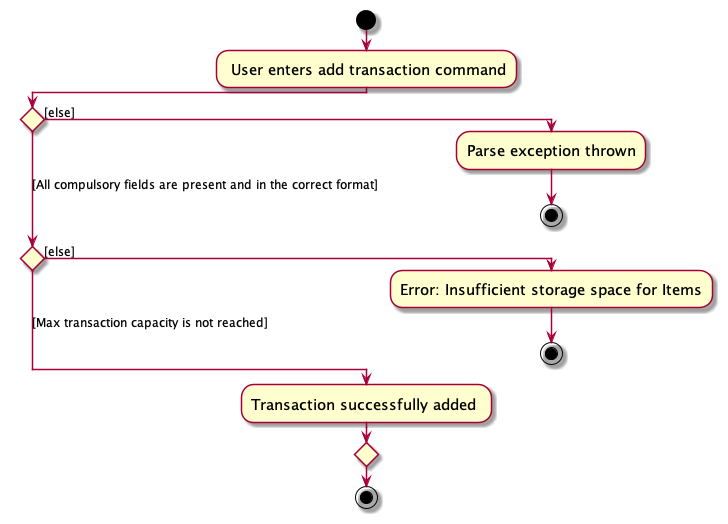

The following sequence diagram shows how the different components of UniCash interact with each other

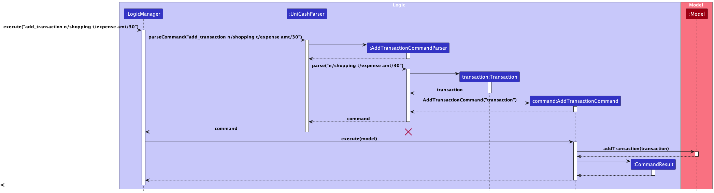

The above sequence diagram omits details on the creation of the attributes of a `Transaction` such as
`Name`, `Type` and `Amount` as it would make the diagram cluttered and difficult to read without adding
additional value.

ℹ️ **Note:** The lifeline for `AddTransactionCommandParser` should end at the destroy marker (X) but due to a limitation of PlantUML,
the lifeline reaches the end of diagram.

##### Details

1. The user specifies the transaction to be added by stating the name, amount, transaction type as well as any other optional fields.
2. The input will be parsed by `AddCommandTransactionParser`, and if it is invalid, `ParserException` is thrown, prompting for the user to enter again.
3. If the input is valid, a `Transaction` object is created and passed into the `AddTransactionCommand` to be executed by the `LogicManager`.
4. The `LogicManager` will then invoke the execute command, adding the `Transaction` to UniCash.

Note that only the `Category` field is allowed to be specified multiple times, while the other fields can only be specified once, else
a `ParserException` is thrown. Another noteworthy point is that `Category` that are added are to be case-insensitively unique and can only be up to
a specified value of 5 in the `UniqueCategoryList` class. Else, a `ParserException` would be thrown.

#### Get Total Expenditure

##### Overview

The `get_total_expenditure` command returns the total expenditure across a given month among all `expense` transactions in UniCa$h, with an optional filter for a given category.

The activity diagram of getting the total expenditure is as shown below

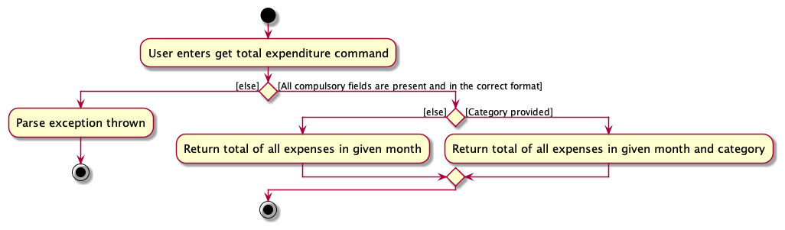

The following sequence diagram shows how the different components of UniCash interact with each other

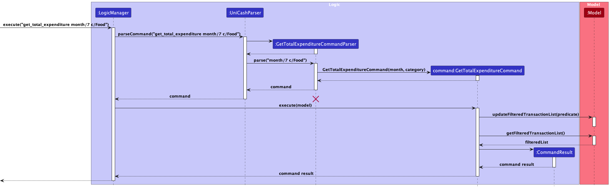

The above sequence diagram omits details on the creation of the arguments of a `GetTotalExpenditureCommand` such as
`Category` as it would make the diagram cluttered and difficult to read without adding additional value. It also omits
the specific `predicate` behavior of provided to perform the filtering.

ℹ️ **Note:** The lifeline for `GetTotalExpenditureCommandParser` should end at the destroy marker (X) but due to a
limitation of PlantUML, the lifeline reaches the end of diagram.

##### Details

1. The user specifies the month to retrieve the total expenditure and the optional category
2. The input will be parsed by `GetTotalExpenditureCommandParser`, and if it is invalid, `ParserException` is thrown,
   prompting for the user to enter again.
3. If the input is valid, a `GetTotalExpenditureCommand` object is created to be executed by the `LogicManager`.
4. The `LogicManager` will then invoke the `execute` method of the command, filtering the existing transaction list to only include `expense` type transactions that fall in the given month and category (if any).
5. The `GetTotalExpenditureCommand` also calculates the total expenditure from this filtered list of transactions.

Note that the month to search is one-indexed, so it ranges from `[1, 12]`. The category is a single filter that is matched in a case-sensitive manner.

#### Delete Transaction

##### Overview

The `DeleteCommand` function deletes an existing `Transaction` from `TransactionList` in UniCash.

The activity diagram of deleting a Transaction is as shown below

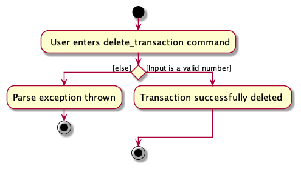

The following sequence diagram shows the interaction between different components of UniCash.

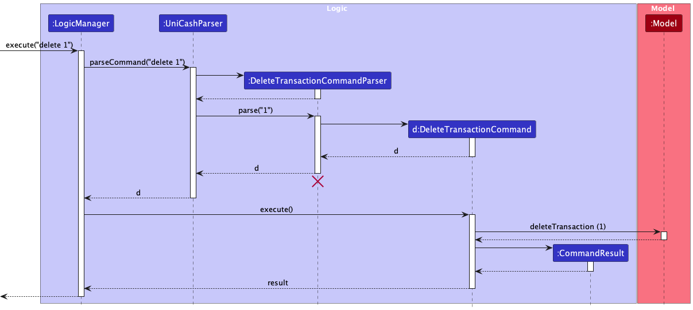

The above sequence diagram omits details on the filtering of `TransactionList` and assumes that
the displayed `TransactionList` is showing all transactions. However, the logic of the `DeleteCommand`
remains the same for all list deletion.

ℹ️ **Note:** The lifeline for `DeleteTransactionCommandParser` should end at the destroy marker (X) but due to a limitation of PlantUML,
the lifeline reaches the end of diagram.

##### Details

1. The user specifies the transaction to be deleted by stating the integer index of the transaction to be deleted.
2. The input will be parsed by `DeleteTransactionCommandParser` and if the provided input is invalid, `ParseException` will be thrown,
   and the user is prompted to enter the command again with the correct input.
3. If the input is valid, an `Index` object is created with the given input integer, and passed into `DeleteTransactionCommand` to be executed
   by `LogicManager`
4. `LogicManger` will invoke the `execute` method of `DeleteTransactionCommand` which will delete the `Transaction` from UniCash.

It is important to take note that when the user input is parsed, it is based on the currently displayed `TransactionList` inside
`TransactionListPanel`. This means that even if a `TransactionList` contains `10` transactions, given a specific nominally valid
number like `7`, it can still throw a `ParseException` if the shown `TransactionList` contains less than `7` items. This feature is
intentional, as the User is able to, for example, `find` a particular group of transaction and immediately delete those transactions
by just looking at their displayed index number without having to refer to an external identifier of that transaction. UniCash will
automatically handle the visual ordering and representation of transactions with the `TransactionsListPanel` in the UI. The details
and diagrams for this part will be elaborated further in the UI section (and other relevant sections) of this Developer Guide.

#### Edit Transaction

##### Overview

The `edit_transaction` command edits an existing `Transaction` from the `TransactionList` in UniCa$h.

The following sequence diagram shows how the different components of UniCa$h interact with each other. It is further explained in the **Details** section below.

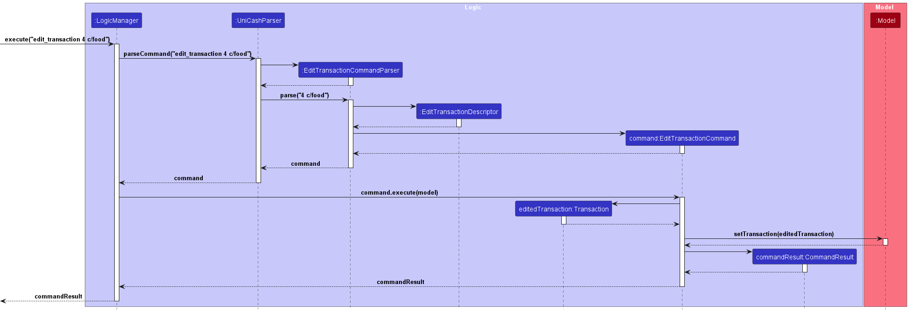


##### Details

1. The user specifies the transaction to be edited by first stating the (one-based) index of the transaction they want to edit. This
   is followed by listing the fields and updated values that they would like to edit.
   (E.g. `edit_transaction 1 n/Food Clique c/food`)
2. The user input with the requested edits will be parsed by `EditCommandTransactionParser`, and if it is invalid, `ParserException` is thrown, prompting for the user to enter again. It is important to note that at this point, a valid index is any integer that is 1 or greater.
3. If the input is valid, the `EditCommandTransactionParser` creates an `EditTransactionDescriptor` object, which contains the edits which the user wishes to make to the transaction.
4. An `EditTransactionCommand` is constructed with the one-based index of the transaction to edit and the `EditTransactionDescriptor` object. This `EditTransactionCommand` is then returned by the `EditCommandTransactionParser`
5. The `LogicManager` will then invoke the execute command of the `EditTransactionCommand`, editing the `Transaction` in UniCa$h.
6. The `EditTransactionCommand#execute` method then first checks if the one-based index is too large (i.e. if there are only `n` transactions, but the index provided is greater than `n`). If this is true, then a `CommandException` is thrown,
   prompting the user to input an index that is at most, the number of transactions available. If the `CommandException` is not thrown at the step above, then the execution proceeds.
7. The `EditTransactionCommand#execute` method then calls the `createEditedTransaction` method, which creates a new `Transaction` object with the updated values after editing. Note that this `Transaction` object is a different object from what is stored in UniCa$h.
8. The `EditTransactionCommand#execute` method then updates UniCa$h with the new `Transaction` using the `Model#setTransaction` method.

Note that although all fields can be edited, the `Name`, `Amount`, and `Type` fields cannot be left blank. The constraints laid
out in the **Add Transaction** section above also remain.

### Budget Management

#### Budget Model

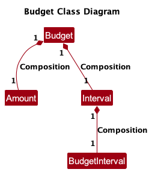

<div class="callout callout-info" markdown="span" style="margin-bottom: 20px;">
The budget is stored in `data/unicash.json`, much like the transactions. Refer to the [storage component](#storage-component) for more details.
</div>

<div class="callout callout-important" markdown="span" style="margin-bottom: 20px;">
For this team project, we have opted to simplify the budgeting feature by limiting the user to a single budget at a time that can be configured for different intervals and amounts.
</div>

UniCa$h tracks a user's budget with the use of `Budget`.

The `Budget` class is composed of the following fields

1. `Amount`: The amount allocated to the budget.
2. `Interval`: The budget interval of the transaction.
   1. `BudgetInterval`: An enum consisting of the values `day`, `week` and `month`.

The following are some noteworthy points regarding the attributes
1. `Amount` here follows the same constraints as the one mentioned in the `Transaction`'s `Amount` class.

#### Set Budget

**Overview**

The `set_budget` command sets a user defined budget globally across UniCa$h.

The activity diagram of getting the total expenditure is as shown below

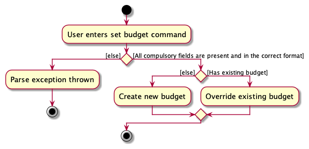

The following sequence diagram shows how the different components of UniCash interact with each other

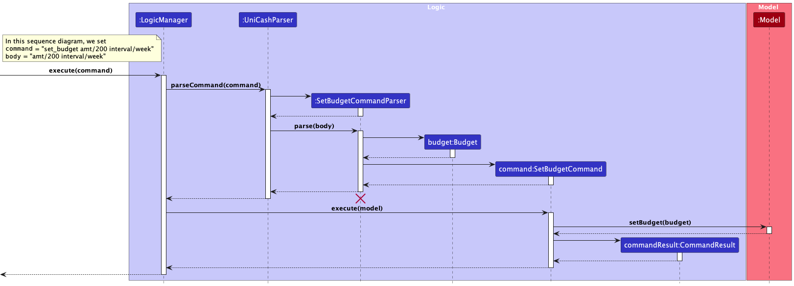

The above sequence diagram omits details on the creation of the arguments of a `SetBudgetCommand` such as
`Amount` and `Interval` as it would make the diagram cluttered and difficult to read without adding additional value. 

It also omits the file saving aspect of this, where the updated budget is saved to the `data/unicash.json` file.

<div class="callout callout-info" markdown="span" style="margin-bottom: 20px;">
The lifeline for `GetTotalExpenditureCommandParser` should end at the destroy marker (X) but due to a
limitation of PlantUML, the lifeline reaches the end of diagram.
</div>

**Details**

1. The user specifies amount and interval that the budget will operate on
2. The input will be parsed by `SetBudgetCommandParser`, and if it is invalid, `ParserException` is thrown,
   prompting for the user to enter again
3. If the input is valid, a `SetBudgetCommand` object is created to be executed by the `LogicManager`
4. The `LogicManager` will then invoke the `execute` method of the command, setting the budget in the `ModelManager`

#### Clear Budget

**Overview**

The `clear_budget` command removes the globally set UniCa$h budget.

<div class="callout callout-important" markdown="span" style="margin-bottom: 20px;">
`clear_budget` will not parse any additional argument or parameters.
</div>

The following sequence diagram shows how the different components of UniCash interact with each other

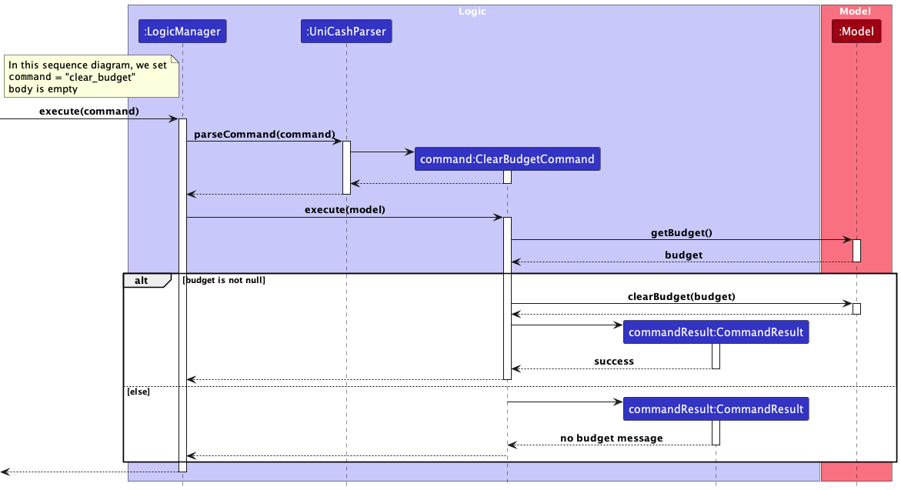

It also omits the file saving aspect of this, where `data/unicash.json` is updated to now hold a `null` budget.

**Details**

1. The user runs the clear budget command
2. The command will be parsed by `UniCashParser` and a `ClearBudgetCommand` object is created and executed by the `LogicManager`
3. The `LogicManager` will then invoke the `execute` method of the command
4. The command will check if UniCa$h currently contains an existing budget, if it does not, a "no budget" message is returned, otherwise, the existing budget is cleared and a success message is returned instead

#### Get Budget

**Overview**

The `get_budget` command computes the total expenditure relative to the existing budget within the given interval.

Intervals work by filtering by the specified time period:
- For `day` intervals, only transactions of the same day are found
- For `week` intervals, only transactions of the same [week of year](https://docs.oracle.com/en/java/javase/11/docs/api/java.base/java/time/temporal/WeekFields.html#weekOfYear()) are found
- For `month` intervals, only transactions of the same month are found

<div class="callout callout-important" markdown="span" style="margin-bottom: 20px;">
`get_budget` will not parse any additional argument or parameters.
</div>

The following sequence diagram shows how the different components of UniCash interact with each other

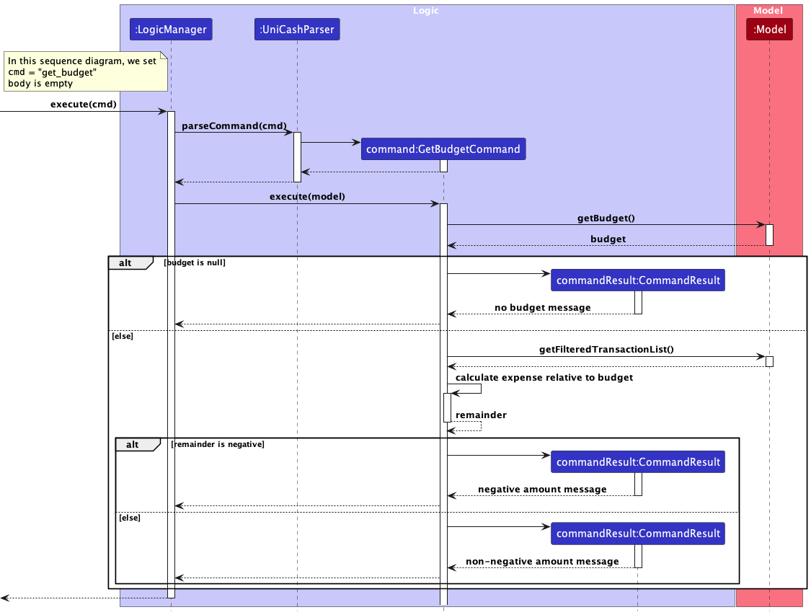

The above sequence diagram omits details such as internal method calls to `GetBudgetCommand#getIntervalFilter` and `GetBudgetCommand#getIntervalString` to reduce clutter.

**Details**

1. The user runs the get budget command
2. The command will be parsed by `UniCashParser` and a `GetBudgetCommand` object is created and executed by the `LogicManager`
3. The `LogicManager` will then invoke the `execute` method of the command
4. The command will check if UniCa$h currently contains an existing budget, if it does not, a "no budget" message is returned, otherwise, the budget remainder will be calculated
5. If the remainder amount is negative (`< 0.00`), then a negative amount message will be returned
6. Otherwise, a non-negative message will be returned

<div class="callout callout-info" markdown="span" style="margin-bottom: 20px;">
The only difference between the negative and non-negative messages is that the negative message places the `-` symbol before the `$` so `-$xx.xx` whereas the non-negative message does not contain the `-` symbol
</div>

#### Summary Statistics

**Overview**

The `summary` command creates a pop-up summary window that contains summary plots to provide some basic analytics about
the user's expense data. 

The activity diagram of the `summary` command is given below:

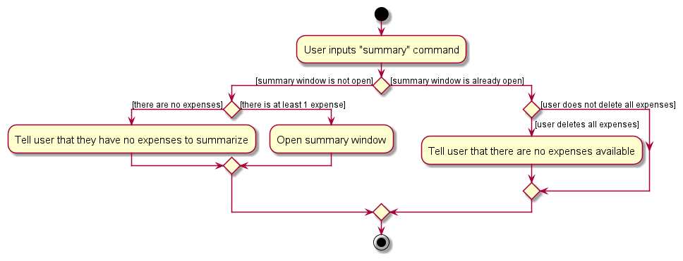

Let's first go over the sequence of events that occur within the Ui component first to understand the code that performs
the activities shown in the activity diagram above. The sequence diagram below documents this:

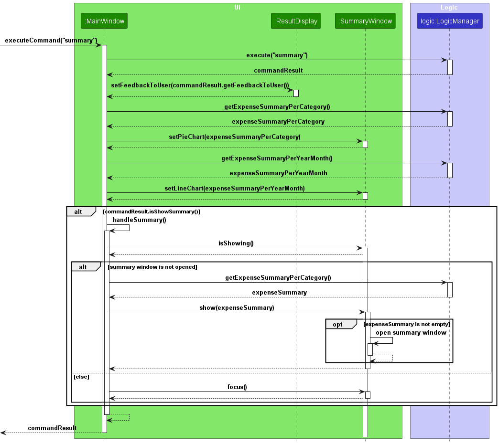

**Details**

1. The user runs the "summary" command
2. The command is parsed by the `Logic` component, which is explained in another sequence diagram below, and returns a
   CommandResult object.
3. `MainWindow` updates the `ResultDisplay` object with the `CommandResult#getFeedbackToUser` method.
4. `MainWindow` retrieves the updated expense summary per category and per year-month from the `Logic` component. It
   then calls `setPieChart` and `setLineChart` on the result to update the pie chart and line chart data (stored within
   `SummaryWindow`).
5. If the `commandResult` object's `showSummary` attribute is `true`, then it indicates that the summary window should
   open. Subsequently, `MainWindow` performs a self-invocation by calling its own `handleSummary` method. Otherwise,
   the execution ends.
6. Under the `handleSummary` method:
   1. `MainWindow` checks to see if `SummaryWindow` is already opened by calling `SummaryWindow#isShowing`. If this is
      false, then `SummaryWindow#focus` is called.
   2. Otherwise, `Logic#getExpenseSummaryPerCategory` is called to retrieve the expense summary per category formatted
      in a `HashMap<String, Double>`. The result is passed as an argument when calling the `SummaryWindow#show` method.
   3. Within the `SummaryWindow#show` method, a check is first performed to determine if the expense summary is empty.
      If this is true, then the summary window does not open. Otherwise, the summary window is opened.

ℹ️ **Note:** Steps 1 to 5 will be called every time a new command is entered. This allows the pie chart and  line chart
to be updated automatically every time the user makes commands that may modify the list of transactions.

Next, we delve deeper into the `Logic` component, specifically when `MainWindow` executed the
`LogicManager.execute("summary")` line of code. The sequence diagram for this portion is given below. 

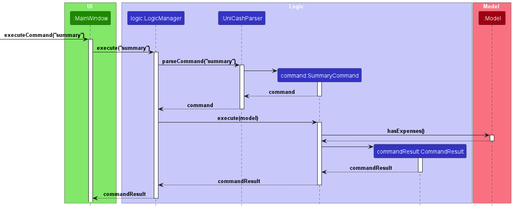

Similar to all other commands, the raw user input String "summary" is parsed by `UniCashParser` to create a
`SummaryCommand` object, which is returned to `LogicManager`. `LogicManager` then calls the `execute` method of the
newly-created `SummaryCommand` object. At this point, the `SummaryCommand` object first checks if there are any expenses
available by calling `Model#hasExpense`. It then instantiates a `CommandResult` object to be returned to `MainWindow`.

ℹ️ **Note:** The arguments provided to the `CommandResult` constructor depends on whether `Model#hasExpense` evaluates to
`true`. In particular, the `feedbackToUser` and `showSummary` parameters of the `CommandResult` constructor differ. If
there are no expenses available, the `feedbackToUser` string will contain a message to tell users that they have no
expenses to summarize. This allows us to display different messages to `ResultDisplay` according to whether there are 
expenses available or not. Also, the `showSummary` parameter will be set to `false`, preventing the
`MainWindow#handleSummary` method from running, as explained in the prior sequence diagram.

### General Utility

#### Clear Transactions

##### Overview

The `ClearTransactionsCommand` deletes all existing `Transactions` from `TransactionList` in UniCash.

The activity diagram of clearing all transactions is as shown below

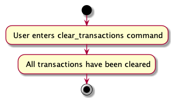

The following sequence diagram shows the interaction between different components of UniCash.

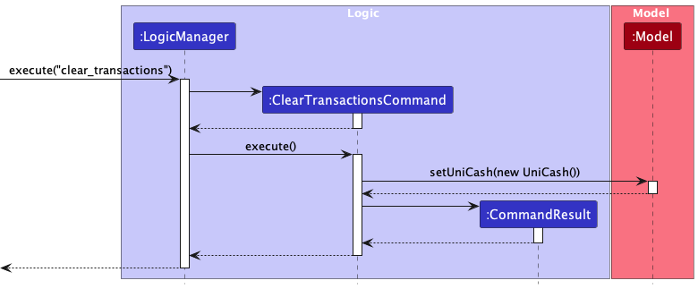

**Note:** Given that `ClearTransactionsCommand` takes in no arguments, it does not have an associated Parser class
like the other `Command` classes. This is currently the case, however, given that the command entirely erases the
existing Unicash, a `ClearTransactionsCommandParser` is proposed to be implemented at a later date to ensure an
additional layer of safety for the User.

##### Details

1. The user inputs the command to reset unicash
2. A `ClearTransactionsCommand` object is created with no arguments.
3. `LogicManager` will invoke the `execute` method of `ClearTransactionsCommand`
   which will replace the existing `Model` property with a new `UniCash` object which
   would contain an empty `TransactionList`.

Here, it must be noted that unlike `DeleteTransactionCommand`, individual transactions in the `TransactionList`
are not deleted singularly. As opposed to iteratively deleting each transaction in the `TransactionList`, the more
efficient way to achieve the same effect would be to simply set the `Model` contained in `LogicManager` to an new
`UniCash` object, as the newly created `UniCash` object would now have an empty `TransactionList` encapsulated within.
This emulates the iterative deletion of all transactions in the `TransactionList`.

#### Help 

##### Overview

The `help` command can be used in 2 different ways.

1. `help` with no arguments.
2. `help COMMAND_WORD` with 1 argument containing a command word.

##### Details

1. `help`

Opens a Help Window with a link to our User Guide and displays a help message on the right panel containing a list of all our commands.

2. `help add_transaction`

A help message specific to the command word on the right panel. The message will contain
information on that command and provide instructions on how to run that command.

#### Exit

`exit`

This command will exit UniCa$h.

### User Interface

#### Summary Statistics

[//]: # (#### etc)

### Minor Features

#### Hash-based coloring

---

[//]: # (## 8. Individual Contributions and Efforts)

[//]: # ()
[//]: # (Here's what each of us have contributed. &#40;Might not need this section&#41;)

[//]: # (---)

## Appendix

### Proposed Changes

To be added

### Known JavaFX Bugs

- Light scrollbars hard to see

### Potential Features

Every user can...

- Divide a group spending and tag friends involved in the spending
- View a price list comparison of all available shops near NUS
- Set recurring transactions

### Links

- [User Stories](https://github.com/orgs/AY2324S1-CS2103-T16-3/projects/1/views/2)
- [Project Website Home](https://ay2324s1-cs2103-t16-3.github.io/tp/)
- [UniCa$h Demo](https://drive.google.com/file/d/1l2Erx-qMpM274AUePf6DDlvSl9G15y6T/view?usp=share_link)
