UniCa$h is a **is a desktop application used for university students who want to be more financially conscious,
optimized for use via a Command Line Interface** (CLI) while still having the benefits of a Graphical User Interface (
GUI). If you can type fast, UniCa$h can get your contact management tasks done faster than traditional GUI apps.

* Table of Contents
  {:toc}

--------------------------------------------------------------------------------------------------------------------

## Quick start

1. Ensure you have Java `11` or above installed in your Computer.

2. Download the latest `unicash.jar` from [coming soon]().

3. Copy the file to the folder you want to use as the _home folder_ for your UniCa$h.

4. Open a command terminal, `cd` into the folder you put the jar file in, and use the `java -jar unicash.jar` command to
   run the application.

   A GUI similar to the below should appear in a few seconds. Note how the app contains some sample data.<br>
   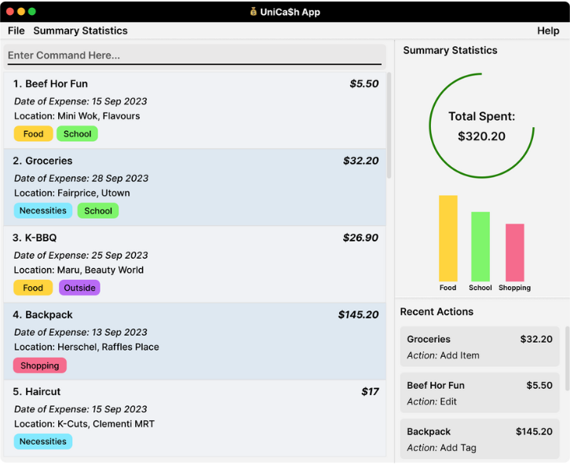

5. Type the command in the command box and press Enter to execute it. e.g. typing **`help`** and pressing Enter will
   open the help window.<br>
   Some example commands you can try:

    * `commands coming soon!`

6. Refer to the [Features](#features) below for details of each command.

--------------------------------------------------------------------------------------------------------------------

## Features

---

### Create Expense [coming soon]

Allows a user to create an expense and all information associated with that expense including the name, amount,
category (defaults to "Others"), location (optional), and date (defaults to the current date) of the expense.

Command: `create <name> -amount <expense amount> [-category <category of expense>] [-date <date of expense>] [-location <location of expense>]`

Command Argument: `name` represents the name of the expense to be added.

Command Options:

| Option Name | Optional? | Purpose                                                                                                            |
|-------------|-----------|--------------------------------------------------------------------------------------------------------------------|
| -amount     | No        | Amount of expense. Currency is SGD.                                                                                |
| -category   | Yes       | Category/type of expense, used to group and filter expenses.<br/>Defaults to "Others" if not specified.            |
| -date       | Yes       | Date of when the expense was made. Follows format `dd/MM/yyyy`.<br/>Defaults to date of creation if not specified. |
| -location   | Yes       | Location where expense was made.<br/>Defaults to `NULL` if not specified.                                          |

#### Expected Outputs

##### Successful Execution

###### Example 1

> **Case**: Create expense with name, amount, date, location, and category
>
> **Input**: `create buy food -amount 7.50 -date 19/09/2023 -location Food Clique -category Food`
>
> **Output**:
> ```
> Successfully created expense "buy food" of category "Food"!
> ```
>
> **Remark**: The expense will be dated 19/09/2023.

###### Example 2

> **Case**: Create expense with name, amount, location, and category but without date
>
> **Input**: `create buy groceries -amount 14.30 -category Food -location Fairprice`
>
> **Output**:
> ```
> Successfully created expense "buy groceries" of category "Food"!
> ```
>
> **Remark**: The expense will be dated whenever the `create` command was executed.

###### Example 3

> **Case**: Create expense with name, amount, and category but without date and location
>
> **Input**: `create buy stuff -amount 13.00 -category Misc`
>
> **Output**:
> ```
> Successfully created expense "buy stuff" of category "Misc"!
> ```
>
> **Remark**: The expense will be dated whenever the `create` command was executed and have a `NULL` location.

###### Example 4

> **Case**: Create expense with name and amount but without date, location, or category
>
> **Input**: `create buy things -amount 10.00`
>
> **Output**:
> ```
> Successfully created expense "buy things" of category "Others"!
> ```
>
> **Remark**: The expense will be dated whenever the `create` command was executed, have a `NULL` location, and be
> assigned to the "Others" category by default.

##### Failed Execution

###### Example 1

> **Case**: Missing `name` of expense
>
> **Input**: `create`
>
> **Output**:
> ```
> Cannot create expense without expense name. Please specify the expense name as such: `create <expense name>`
> ```

###### Example 2

> **Case**: Missing `amount` option of expense
>
> **Input**: `create buy something!`
>
> **Output**:
> ```
> Cannot create expense without amount of expenditure. Please specify the expense amount as such: `create <expense name> -amount <expense amount>`
> ```

###### Example 3

> **Case**: Invalid `amount` option value.
>
> **Input**: `create buy something! -amount hi`
>
> **Output**:
> ```
> Failed to create expense as amount is invalid, ensure that it is a number.
> ```

###### Example 4

> **Case**: Invalid `date` option value.
>
> **Input**: `create buy something! -amount 14.30 -date today`
>
> **Output**:
> ```
> Failed to create expense as date is invalid, ensure that it is the following format: `dd/MM/yyyy`.
> ```

### Edit Expense [coming soon]

Allows a user to make edits to an existing expense, and all associated information.

Command: `edit <expense_id> -<name of attribute 1> <new attribute 1 value> [-<name of attribute N> <new attribute N value> …]`

Command Argument: `expense_id` is the ID of the expense to edit.

Command Options:

| Option Name        | Optional? | Purpose                                                                                                                                                                                                                                                                                                                                                                                                                                                                                                                                                       |
|--------------------|-----------|---------------------------------------------------------------------------------------------------------------------------------------------------------------------------------------------------------------------------------------------------------------------------------------------------------------------------------------------------------------------------------------------------------------------------------------------------------------------------------------------------------------------------------------------------------------|
| -name of attribute | No        | The attribute to make edits to. Possible values: `name`, `amount`, `category`, `date`, `location`<br/><br/>Note: If `name of attribute` is date, then the associated `new attribute value` must be in format: `dd/MM/yyyy`.<br/>Note: If `name of attribute` is amount, then the associated `new attribute value` must be a number.<br/>Note: If `name of attribute` is not name or amount, then the associated `new attribute value` can be empty if the user wants to reset the attribute to the default value (NULL for location and Others for category). |
| ...                | Yes       | More `name of attribute` `new attribute value` pairs to make more edits to the same expense                                                                                                                                                                                                                                                                                                                                                                                                                                                                   |

#### Expected Outputs

##### Successful Execution

###### Example 1

> **Case**: Editing one attribute of expense 3
>
>**Input**: `edit 3 -location online`
>
>**Output**:
> ```
> Successful edits to expense 3:
> location : online
> ```

###### Example 2

> **Case**: Setting the expense’s category to be default of “Others”
>
>**Input**: `edit 2 -category -location frontier pasta express -amount 5.8
`
>
>**Output**:
> ```
> Successful edits to expense 1:
> category : “Others”
> location : frontier pasta express
> amount : $5.80
> ```

#### Failed Execution

###### Example 1

> **Case**: No attributes to edit
>
>**Input**: `edit 1`
>
>**Output**:
> ```
> Please input an attribute to edit, and the new value to change the attribute to.
> Syntax: edit <integer> -<name of attribute> <new attribute value>
> ```

###### Example 2

> **Case**: New attribute value for `name` is empty
>
>**Input**: `edit 1 -name`
>
>**Output**:
> ```
> Attributes “name” and “amount” cannot be empty
> ```

###### Example 3

> **Case**: There are only 10 expenses in the list, but user tries to edit expense 100000
>
>**Input**: `edit 100000 -location online`
>
>**Output**:
> ```
> There are only 10 expenses. Please provide an integer between 1 and 10 (received: 100000)
> ```

###### Example 4

> **Case**: Wrong input format for “date” and “amount” attribute
>
>**Input**: `edit 2 -date yesterday -amount 5.80.`
>
>**Output**:
> ```
> Attribute “date” must be of the form dd/MM/yyyy (received: yesterday)
> Attribute “amount” must be a number (received: 5.80.)
> ```

### Delete Expense [coming soon]
Allows a user to delete a previously added expense and all information associated with that expense.

Command: `delete <name>`

Command Argument: `name` represents the exact name of the expense intended to be deleted. 
Has to exactly match a given expense, or else the command will do nothing, 
so as to ensure the integrity of user data.

#### Expected Outputs

##### Successful Execution

###### Example 1

>**Case**:  Delete expense named “friday mcdonalds”
>
>**Input**: `delete "friday mcdonalds"`
> 
> **Output**:
>```
>Successfully deleted expense “friday mcdonalds”!
>```
>**Remark**: The expense will be removed from file

##### Unsuccessful Execution

###### Example 1

>**Case**:  Delete expense command entered with no argument provided
>
>**Input**: `delete `
> 
>**Output**:
>```
>No expense deleted. Delete command must be followed with an expense to be deleted like this: delete <expense>.
>```
>**Remark**: No expenses will be removed and no changes made to file.

###### Example 2

>**Case**:  Delete expense command entered with no matching expense name
>
>**Input**: `delete asdf`
> 
>**Output**:
>```
>No expense deleted. Delete command must be followed with a valid expense name.
>```
>**Remark**: No expenses will be removed and no changes made to file.


### Mass Delete Expense [coming soon]
Allows a user to delete all added expenses, and all associated information.

Command: `delete_all_expenses`

Command Argument:  No arguments are needed for this command. 
The command is intentionally lengthy to ensure that mass deletion of all expenses is done intentionally.

Remarks: Confirmation for mass deletion to be implemented at a later date.

#### Expected Outputs

##### Successful Execution

###### Example 1

>**Case**:  Delete all expenses
>
>**Input**: `delete_all_expenses`
> 
>**Output**:
>```
>Successfully deleted all expenses!
>```
>**Remark**: All expenses will be removed from file

##### Unsuccessful Execution

###### Example 1

>**Case**:  Mass deletion command entered improperly
>
>**Input**: `delete_all `
> 
>**Output**:
>```
> Invalid command.
>```
>**Remark**: No expenses will be removed and no changes made to file.

###### Example 2

>**Case**:  Wrong delete command entered
>
>**Input**: `delete`
> 
>**Output**:
>```
> No expense deleted. Delete command must be followed with an expense to be deleted like this: delete <expense>.
>```
>**Remark**: No expenses will be removed and no changes made to file. 
> The above error is the same as the one for the simple “delete” function. 
> In the above example, the delete_all_expenses functionality is 
> intentionally obfuscated to prevent the user from accidental mass deletions. 
> The rationale is that a user unsure of a basic command like delete is probably a new user, 
> and a new user should not be directed to mass delete information. 
> There are other, more proper ways to convey this information, such as this User Guide.


### List Expenses [coming soon]
Allows a user to retrieve a list of all their past expenses with details on where it was spent, type of spending and how much was spent.

Command: `list`

#### Expected Outputs

##### Successful Execution

###### Example 1

>**Case**:  Calling the command when there are no existing expenses.
>
>**Input**: `list`
>
>**Output**:
>```
>You have no expenses!
>```

###### Example 2

>**Case**:  Calling the command with existing expenses.
>
>**Input**: `list`
>
>**Output**:
>```
>1. buy groceries 23/09/23 - $15.20 (groceries)
>2. lunch at fc 23/09/23 - $5.50 (meals)
>```

##### Failed Execution

###### Example 1
>**Case**: Calling the command with any parameters
>
>**Input**: `list 5`
>
>**Output**:
>```
>Command not recognised. Try using the command “list” instead.
>```

### Find Expenses [coming soon]
Allows a user to retrieve the expense(s) that contain/matches any of the given keywords.

Command: `find <keyword>`

Command Parameters: `<keyword>` is the keyword to look for in any of the stored expenses, it can be a single word or multiple words separated by spaces.

#### Expected Outputs

##### Successful Execution

###### Example 1

>**Case**:  Calling the command when there are no matching expenses.
>
>**Input**: `find chicken`
>
>**Output**:
>```
>You have no matching expenses!
>```

###### Example 2

>**Case**:  Calling the command with keywords that match existing expenses.
>
>**Input**: `find lunch`
>
>**Output**:
>```
>2 expenses found containing the word(s) “groceries”:
>
>1. lunch at holland 16/09/23 - $15.20 (groceries)
>4. lunch at fc 23/09/23 - $5.50 (meals)
>```
>**Note:** Index of retrieved list is respective to the order of the full expense list so index of 4 is the 4th expense stored in the system.

##### Failed Execution

###### Example 1
>**Case**: Calling the command without any parameters
>
>**Input**: `find`
>
>**Output**:
>```
>The “find” command requires at least one word to search.
>```

### Tabulate Total Expense [coming soon]
Allows a user to view their total expenditure, filtered by category of spending or by month.

Command: `total [-category <category>] [-month <month>]`

Command Options:

| Option Name | Optional? | Purpose                                                                                                                                                |
|-------------|-----------|--------------------------------------------------------------------------------------------------------------------------------------------------------|
| -category   | Yes       | Category / type of expense. Defaults to accounting for all categories if not specified.                                                                |
| -month      | Yes       | Month of expenditure. Can either be the shorthand of the name like Sep or full name like September. <br/><br/>Defaults to all months if not specified. |

#### Expected Outputs

##### Successful Execution

###### Example 1

>**Case**:  Calling the command with no options.
>
>**Input**: `total`
>
>**Output**:
>```
>Your total expenditure recorded is $1388.
>```

###### Example 2

>**Case**:  Calling the command with a specified category.
>
>**Input**: `total -category food`
>
>**Output**:
>```
>Your total expenditure recorded for food is $780.
>```

###### Example 3

>**Case**:  Calling the command with a specified month.
>
>**Input**: `total -month June`
>
>**Output**:
>```
>Your total expenditure recorded for June is $400.
>```

###### Example 4

>**Case**:  Calling the command with a specified category and month.
>
>**Input**: `total -category food -month June`
>
>**Output**:
>```
>Your total expenditure recorded for food in June is $230.
>```

##### Failed Execution

###### Example 1
>**Case**: Calling the command with a category that doesn’t exist.
>
>**Input**: `total -category chicken -month june`
>
>**Output**:
>```
>The category "chicken" doesn't exist.
>```

###### Example 2
>**Case**: Calling the command with a month that doesn’t exist.
>
>**Input**: `total -category food -month juely`
>
>**Output**:
>```
>The month "juely" doesn't exist.
>```

###### Example 3
>**Case**: Calling the command with a category and month that doesn’t exist.
>
>**Input**: `total -category chicken -month juely`
>
>**Output**:
>```
>The category "chicken" and month "juely" doesn't exist.
>```

### Create Income

Allows a user to register an inflow of money (income) into the application.
Our application will store an income based on the name, value, date.

Command: `create_income <name> [-value <value of income>] [-date <date of expense>]`

Command Argument: `name` represents the name of the income to be added.

Command Options:

| Option Name | Optional? | Purpose                                                                                                                |
|-------------|-----------|------------------------------------------------------------------------------------------------------------------------|
| -value      | No        | Value of expense. Represents a positive number (integer/ float).                                                       |
| -date       | Yes       | Date of when the expense was made. Follows format  dd/MM/yyyy <br><br>  Defaults to date of creation if not specified. |

#### Expected Outputs

##### Successful Execution

###### Example 1

> **Case**:  Create “work at lifo” income dated 19/09/2023 with value of 900.
>
>**Input**: `create_income work at liho -date 19/09/2023 -value 900`
>
>**Output**: Successfully created income “work at liho”!
>
>**Remark**: The income will be dated 19/09/2023.

##### Failed Execution

###### Example 1

> **Case**: Missing `name` of income
>
>**Input**: `create_income`
>
>**Output**: Cannot create income without income name.
> Please specify the income name as such: `create_income <name> -value <value>`

###### Example 2

> **Case**: Missing `value` of income
>
>**Input**: `create_income working`
>
>**Output**: Cannot create income without income value.
> Please specify the income name as such: `create_income <name> -value <value>`

###### Example 3

> **Case**: Invalid `value` form (not positive number)
>
>**Input**: `create_income working -value hi`
>
>**Output**: Cannot create income due to invalid income value type. Ensure that it is a positive number.

###### Example 4

> **Case**: Invalid `date` of income
>
>**Input**: `create_income working -value 1300 -date today`
>
>**Output**: Cannot create income due to invalid date format. Ensure that it follows dd/MM/yyyy.

### Delete Income

Allows a user to delete an income previously added into the application.

Command: `delete_income <name>`

#### Expected Outputs

##### Successful Execution

###### Example 1

> **Case**: Delete “work at liho” income.
>
>**Input**: `delete_income work at liho`
>
>**Output**: Successfully deleted expense “work at liho”

##### Failed Execution

###### Example 1

> **Case**: Missing `name` of income
>
>**Input**: `delete_income`
>
>**Output**: Cannot delete income without income `name`.
> Please specify the income name as such: `delete_income <name>`

### Find Income

Allows a user to search for an income(s) that was previously entered.
User can find income(s) through name.

Command: `find_income [-name <name of income>] [-value_more <value of income>] [-value_less <value of income>] [-date <date of income>]`

Command Options:

| Option Name | Optional? | Purpose                                                                                                |
|-------------|-----------|--------------------------------------------------------------------------------------------------------|
| -name       | Yes       | Name of income to find.                                                                                |
| -value_more | Yes       | Value of income, used to filter income more than value.                                                |
| -value_less | Yes       | Value of income, used to filter income less than value.                                                |
| -date       | Yes       | Date of when the income was made. Follows format dd/MM/yyyy.<br><br>Filters income added on that date. |

<div markdown="span" class="alert alert-primary">:bulb: **Note:**
If no options are specified, all income is returned.
</div>

#### Expected Outputs

##### Successful Execution

###### Example 1

> **Case**: Find “work at liho” income.
>
>**Input**: `find_income work at liho`
>
>**Output**: Successfully found income “work at liho”. Display information related to the income

##### Failed Execution

###### Example 1

> **Case**: Missing `name` of income
>
>**Input**: `find_income`
>
>**Output**: Cannot find income without income name.
> Please specify the income name as such: `find_income <name>`

###### Example 2

> **Case**: Invalid `date` format
>
>**Input**: `find_income work at liho -date tomorrow`
>
>**Output**: Cannot find income due to invalid date format. Ensure that it follows dd/MM/yyyy.

### Archiving data files `[coming in v2.0]`

_Details coming soon ..._

--------------------------------------------------------------------------------------------------------------------

## FAQ

**Q**: How do I transfer my data to another Computer?

**A**: Install the app in the other computer and overwrite the empty data file it creates with the file that contains
the data of your previous UniCa$h home folder.

--------------------------------------------------------------------------------------------------------------------

## Known issues

1. Currently no known issues!

--------------------------------------------------------------------------------------------------------------------

## Command summary

| Action                     | Format, Examples                                                                                                                                                                                                                       |
|----------------------------|----------------------------------------------------------------------------------------------------------------------------------------------------------------------------------------------------------------------------------------|
| **Create Expense**         | `create <name> -amount <expense amount> [-category <category of expense>] [-date <date of expense>] [-location <location of expense>]` <br> e.g., `create buy food -amount 7.50 -date 19/09/2023 -location Food Clique -category Food` |
| **Delete Expense**         | `delete <name>`<br> e.g., `delete grabfood_lunch`                                                                                                                                                                                      |                                                                                                                                                                                                                       |
| **Mass Delete Expenses**   | `delete_all_expenses`                                                                                                                                                                                                                  |
| **Edit Expenses**          | `edit <expense_id> -<name of attribute 1> <new attribute 1 value> [-<name of attribute N> <new attribute N value> …​]`<br> e.g.,`edit 3 -location online`                                                                              |
| **List Expenses**          | `list`                                                                                                                                                                                                                                 |
| **Find Expenses**          | `find <keyword>` <br> e.g., `find lunch`                                                                                                                                                                                               |
| **Tabulate Total Expense** | `total [-category <category>] [-month <month>]` <br> e.g., `total -category Food -month June`                                                                                                                                          |
| **Create Income**          | `create_income <name> [-value <value of income>] [-date <date of expense>]` <br> e.g., `create_income work at liho -date 19/09/2023 -value 900`                                                                                        |
| **Delete Income**          | `delete_income <name>`                                                                                                                                                                                                                 |
| **Find Income**            | `find_income <name> [-value_more <value of income>] [-value_less <value of income>] [-date <date of income>]` <br> e.g., `find_income work at liho`                                                                                    |


---
# START OF NEW UG
This header exists to separate the old and new UG format. Add your contributions to the
relevant sections below and copy over previous contributions while doing so.  By submission time, this header should be at the top of the
page, right below the page frontmatter.

**Remove this header before final submission.**

End of header.

---

## 1. About UniCa$h 

Unicash is this and that ...

## 2. Index of Contents

## 3. Quick Start

### 3.1 Installation

1. Ensure you have Java `11` or above installed in your Computer.

2. Download the latest `unicash.jar` from [our latest release](https://github.com/AY2324S1-CS2103-T16-3/tp/releases/tag/v1.3).

3. Copy the file to the folder you want to use as the _home folder_ for your UniCa$h.

4. Open a command terminal, `cd` into the folder you put the jar file in, and use the `java -jar unicash.jar` command to
   run the application.

   A GUI similar to the below should appear in a few seconds. Note how the app contains some sample data.<br>
   

5. Type the command in the command box and press Enter to execute it. e.g. typing **`help`** and pressing Enter will
   open the help window.<br>

6. Refer to the [Features](#features) below for details of each command.

### 3.2 UI Layout 

UI layout and description of what each section means

### 3.3 Command Breakdown

Breakdown the command and the different prefixes

Talk about how capitalised names are used as example placeholders of values
n/NAME, means the capitalised NAME is a placeholder value

### 3.4 Command Execution Tutorial

Walkthrough of how to run a command with visual guides

## 4. Features

### Features Overview

For UniCa$h, we have developed and implemented 4 main groups of commands. These are: 

The Transaction Commands:
- Add Transaction
- Delete Transaction
- Find Transactions
- Get Transaction
- List Transactions
- Clear All Transactions

The Financial Statistics Commands:
- Get Total Expenditure 
- Summary Statistics

The General Utility Commands:
- Show Help
- Reset UniCa$h
- Exit UniCa$h

The instructions for the usage of each command within each feature group are elaborated in this section below.


### 4.1 Transaction Commands

#### 4.1.1 AddTransactionCommand

Adds a new `Transaction` to UniCa$h.

Command: `add_transaction n/NAME type/TYPE amt/AMOUNT dt/DATETIME l/LOCATION c/CATEGORY`

Command Options:

| Option Name | Optional? | Purpose                                                                                       |
|-------------|-----------|-----------------------------------------------------------------------------------------------|
| n/          | No        | Name of the transaction.                                                                      |
| type/       | No        | Transaction type of transaction.<br/>Valid types are `income` and `expense`.                  |
| amt/        | No        | Monetary amount of transaction. Has to be a positive value.                                   |
| dt/         | Yes       | Date and time where transaction was made.<br/>Defaults to current date time if not specified. |
| l/          | Yes       | Location where transaction was made.<br/>Defaults to `''` if not specified.                   |
| c/          | Yes       | Category tagged to that transaction.<br/>No categories tagged if not specified.               |

Important notes:
1. There is a character limit for `Name` and `Location` set at up to 500 characters.
2. `Amount` entered has to be positive for both `income` and `expense`.
3. `Amount` is automatically rounded to 2 decimal places.
4. `UniqueCategoryList` enforces a unique (case-insensitive) constraint on `Category` it stores.
5. `UniqueCategoryList` enforces a max size of 5 `Category`
6. There is a character limit for `Category` set at up to 15 characters/

##### Successful Execution

###### Example 1

> **Case**: Add transaction with name, amount, type, datetime, location and a category.
>
> **Input**: `add_transaction n/Buying groceries type/expense amt/300 dt/18-08-2023 19:30 l/ntuc c/household`
>
> **Output**:
> ```
> New transaction added:
> 
> Name: Buying groceries;
> Type: expense;
> Amount: $300.00;
> Date: 18 Aug 2023 19:30;
> Location: ntuc;
> Categories: #household
> ```
> 
> 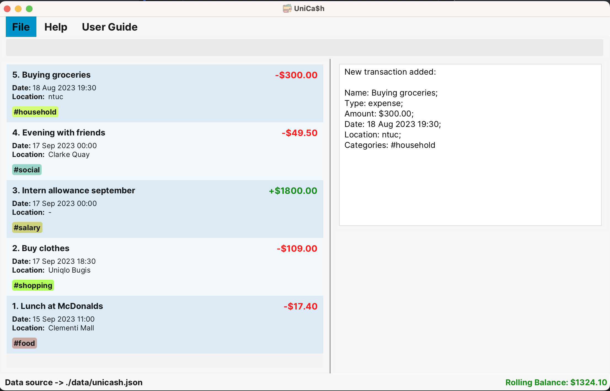

###### Example 2

> **Case**: Add transaction with name, amount and type.
>
> **Input**: `add_transaction n/Working type/income amt/8000`
>
> **Output**:
> ```
> New transaction added:
> 
> Name: Working;
> Type: income;
> Amount: $8000.00;
> Date: 28 Oct 2023 19:01;
> Location: -;
> Categories:
> ```
>
> 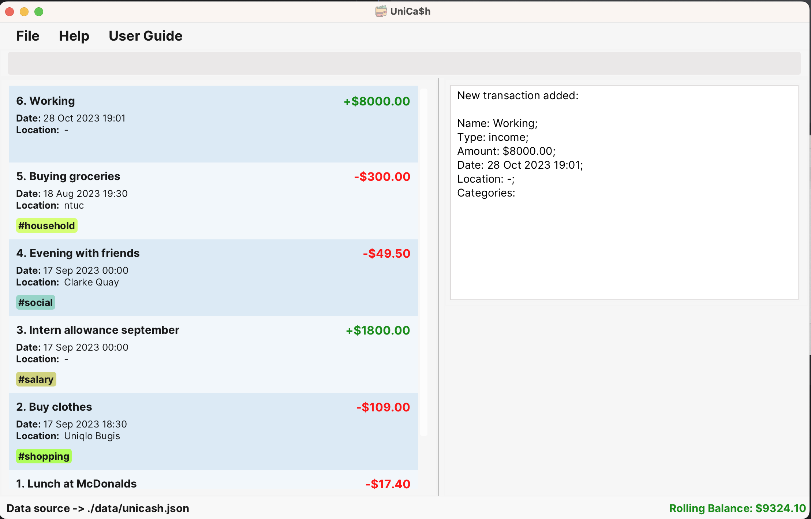

##### Failed Execution

###### Example 1

> **Case**: Missing compulsory fields.
>
> **Input**: `add_transaction`
>
> **Output**:
> ```
> Invalid command format! 
>
> add_transaction: Adds a transaction to UniCa$h.
>
> Parameters: n/NAME type/TYPE amt/AMOUNT dt/DATETIME l/LOCATION [c/CATEGORY]...
>
> Example: add_transaction n/Buying groceries type/expense amt/300 dt/18-08-2023 19:30 l/ntuc c/household
> ```
> 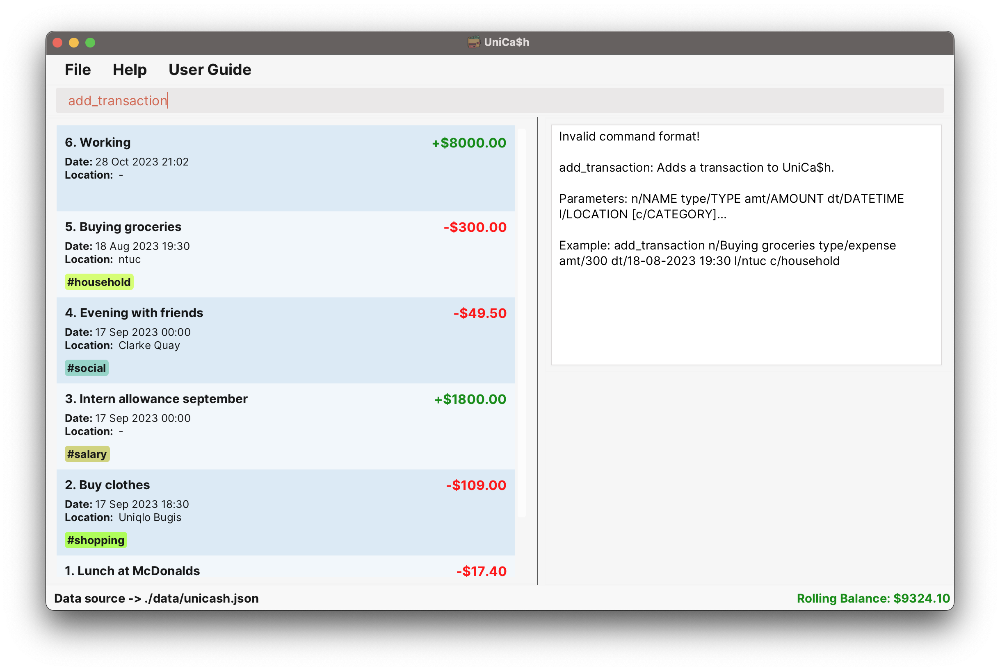

###### Example 2

> **Case**: Duplicate categories with valid compulsory fields.
>
> **Input**: `add_transaction n/Buying groceries type/expense amt/300 c/household c/household`
>
> **Output**:
> ```
> All categories must be case-insensitively unique, duplicate categories are not allowed.
> ```
> 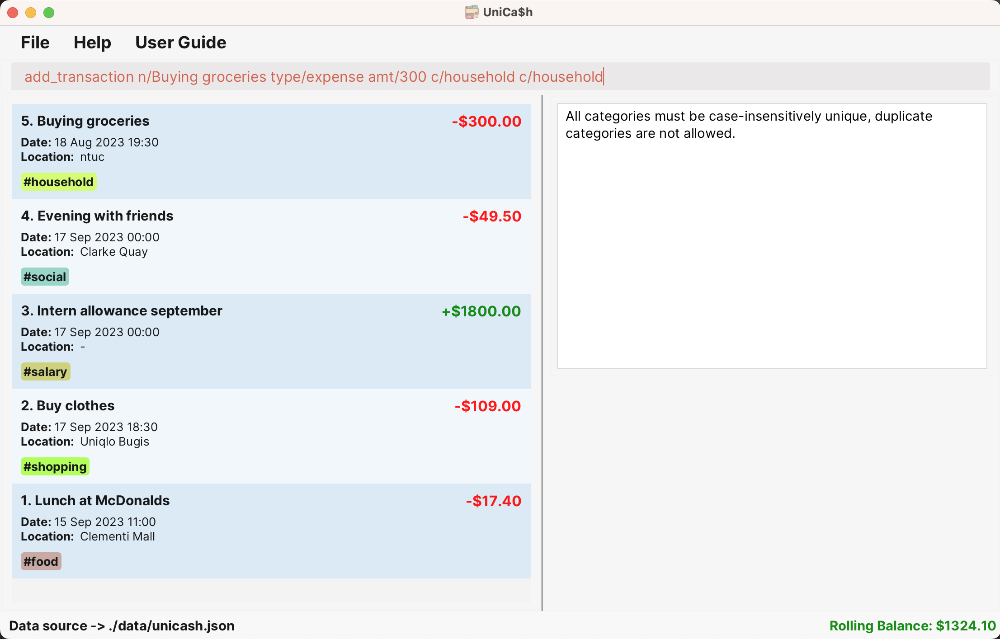

###### Example 3

> **Case**: More than 5 categories with valid compulsory fields.
>
> **Input**: `add_transaction n/Buying groceries type/expense amt/300 c/household c/entertainment c/education c/fun c/school c/test`
>
> **Output**:
> ```
> There should only be a maximum of 5 unique categories.
> ```
> > 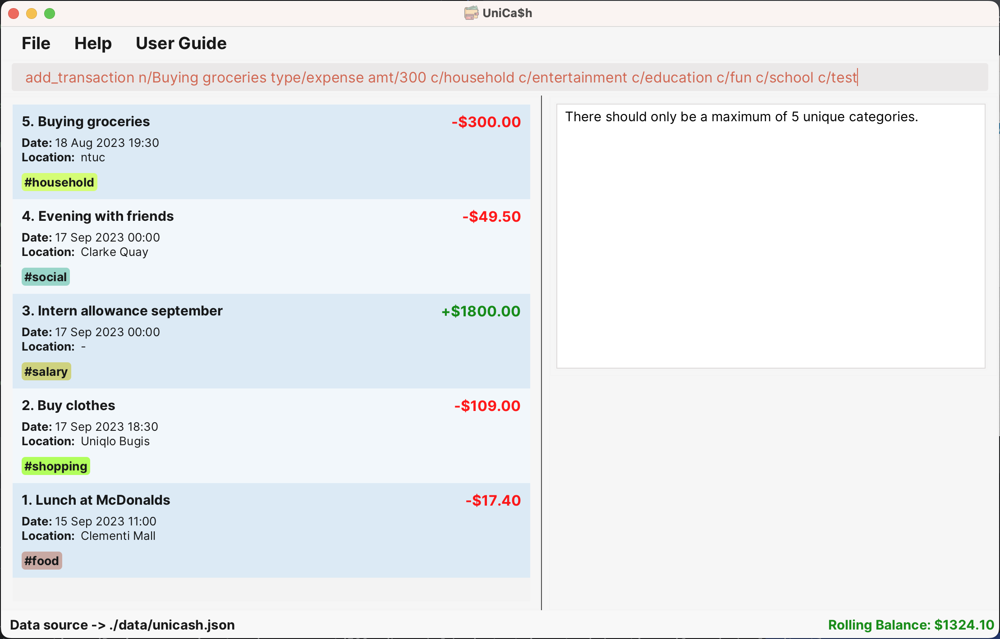


#### 4.1.3 EditTransactionCommand

#### 4.1.4 DeleteTransactionCommand

Deletes a `Transaction` from UniCa$h.

Command: `delete_transaction <INDEX>`

Command Word: `delete_transaction` (case-insensitive)

Command Argument: `<INDEX>` is the displayed transaction index 
of the transaction to be deleted, as shown in the `Transactions List`.

| Arguments | Optional? | Purpose                                            |
|-----------|-----------|----------------------------------------------------|
| `<INDEX>` | No        | Transaction index of the transaction to be deleted |

Important notes:
1. The `delete_transaction` command word is case-insensitive, thus `DELETE_TRANSACTION` is 
considered an equivalent command word. 

2. `<INDEX>` must be a positive integer, i.e. a number greater than 0.

3. `<INDEX>` must be equal to or smaller than 2,147,483,647 which is the `Integer.MAX_VALUE` provided by Java 11.

4. `<INDEX>` must be equal to or smaller than the largest displayed transaction index
   of all transactions as shown in the `Transactions List`. Thus, even if there are `100` total transactions but only
   `20` of those transactions are displayed in the current `Transactions List`, the maximum `INDEX` allowed
   would be `20`

5. Given `3.` and `4.`, the maximum allowed `<INDEX>` is the smaller value of the two.

##### Successful Execution

###### Example 1

> **Case**: Delete a transaction with the correctly specified `<INDEX>`.
>
> **Input**: `delete_transaction 1`
>
> **Output**:
> ```
> Deleted Transaction:
>
> Name: Evening with friends;
> Type: expense;
> Amount: $49.50;
> Date: 17 Sep 2023 00:00;
> Location: Clarke Quay;
> Categories: #social
> ```
> Input:
> 
> Output:
> 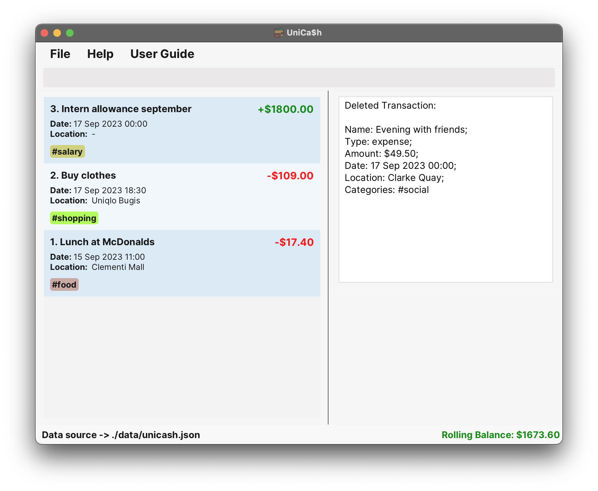

###### Example 2

> **Case**: Delete a transaction with the currently not visible but correctly specified `<INDEX>`.
>
> **Input**: `delete_transaction 1`
>
> **Output**:
> ```
> Deleted Transaction:
> 
> Name: Lunch at McDonalds;
> Type: expense;
> Amount: $17.40;
> Date: 15 Sep 2023 11:00;
> Location: Clementi Mall;
> Categories: #food
> ```
> Input:
> 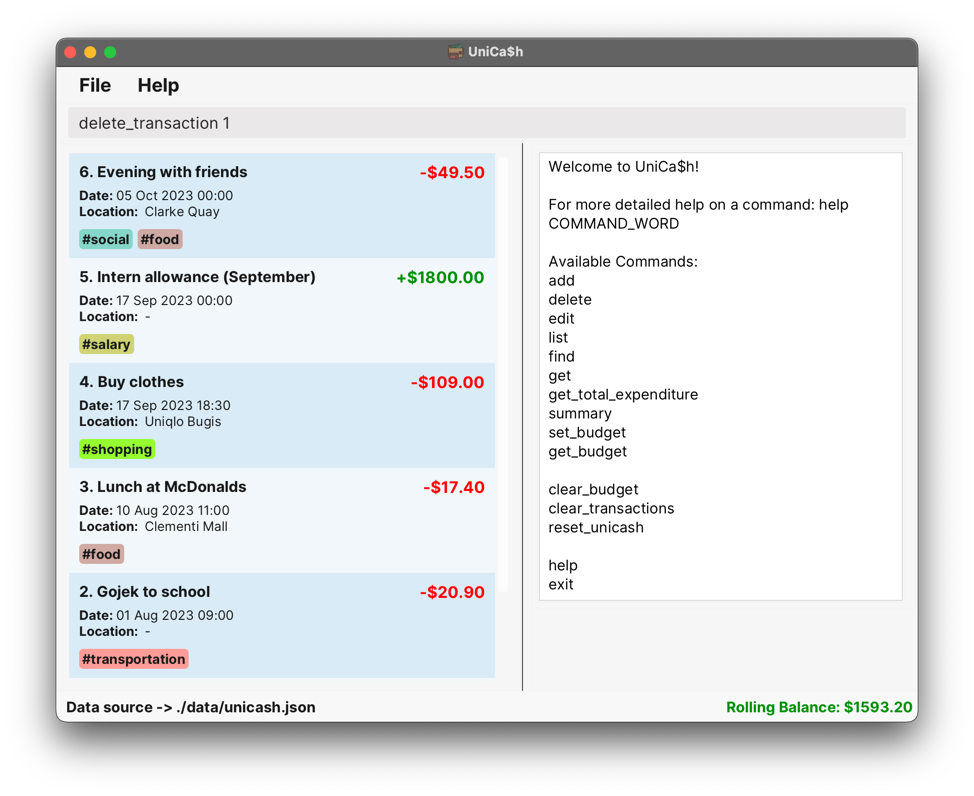
> Ouput:
> 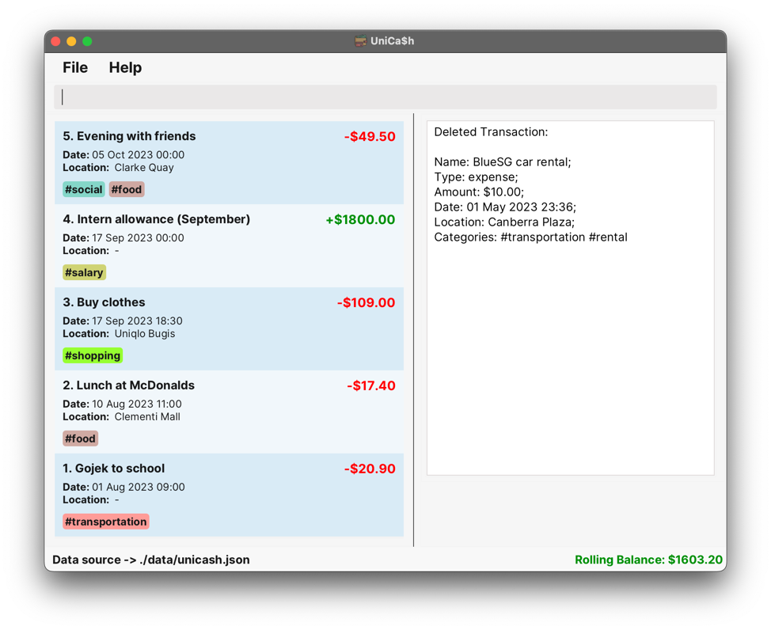


##### Failed Execution

###### Example 1

> **Case**: Missing compulsory fields.
>
> **Input**: `delete_transaction`
>
> **Output**:
> ```
> Invalid command format! 
>
> delete_transaction: Deletes the transaction identified by the index number used in the displayed transaction list.
>
> Argument: Index (must be a positive integer)
>
> Example: delete_transaction 1
> ```
> 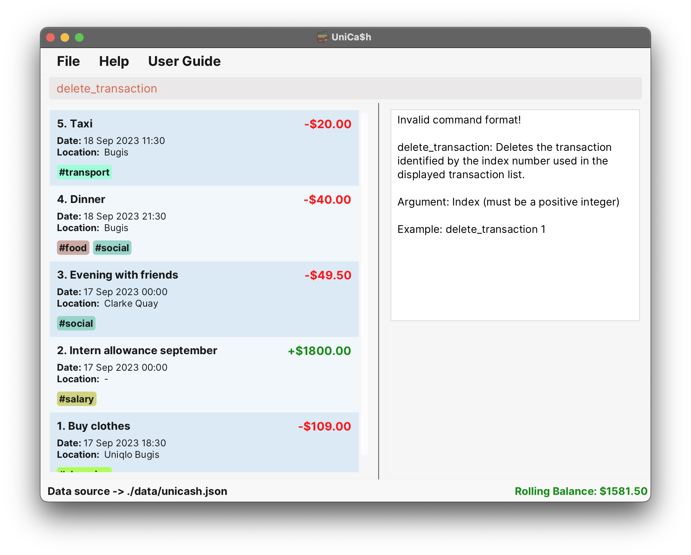

###### Example 2

> **Case**: Invalid `<INDEX>` provided
> (`<INDEX>` given as `10` given when only `5` transactions are presently displayed)
>
> **Input**: `delete_transaction 10`
>
> **Output**:
> ```
> The transaction index provided is invalid
> ```
> 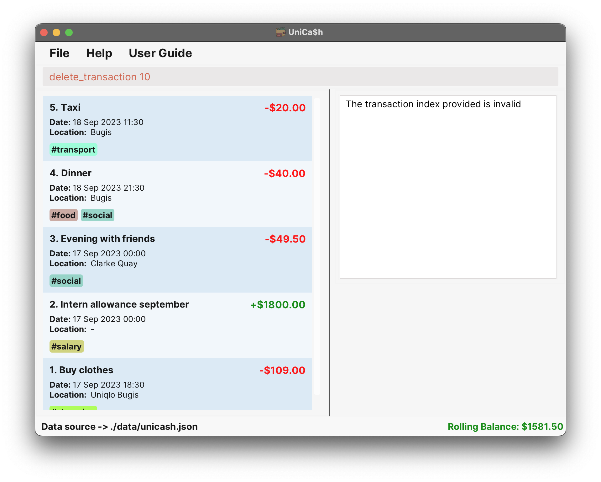

#### 4.1.5 FindCommand

#### 4.1.6 GetCommand

Retrieves a `Transaction` from UniCa$h.

Command: `get <INDEX>`

Command Word: `get` (case-insensitive)

Command Argument: `<INDEX>` is the displayed transaction index
of the transaction to be retrieved, as shown in the `Transactions List`.

| Arguments | Optional? | Purpose                                              |
|-----------|-----------|------------------------------------------------------|
| `<INDEX>` | No        | Transaction index of the transaction to be retrieved |

Important notes:
1. The `get` command word is case-insensitive, thus `GET` is
   considered an equivalent command word.

2. `<INDEX>` must be a positive integer, i.e. a number greater than 0.

3. `<INDEX>` must be equal to or smaller than 2,147,483,647 which is the `Integer.MAX_VALUE` provided by Java 11.

4. `<INDEX>` must be equal to or smaller than the largest displayed transaction index
   of all transactions as shown in the `Transactions List`. Thus, even if there are `100` total transactions but only
   `20` of those transactions are displayed in the current `Transactions List`, the maximum `INDEX` allowed
   would be `20`

5. Given `3.` and `4.`, the maximum allowed `<INDEX>` is the smaller value of the two.

##### Successful Execution

###### Example 1

> **Case**: Retrieve a transaction with the correctly specified `<INDEX>`.
>
> **Input**: `get 5`
>
> **Output**:
> ```
> Transaction 5 retrieved:
> 
> Name: Taxi;
> Type: expense;
> Amount: $20.00;
> Date: 18 Sep 2023 11:30;
> Location: Bugis;
> Categories: #transport
> ```
> Input:
> 
> Ouput:
> 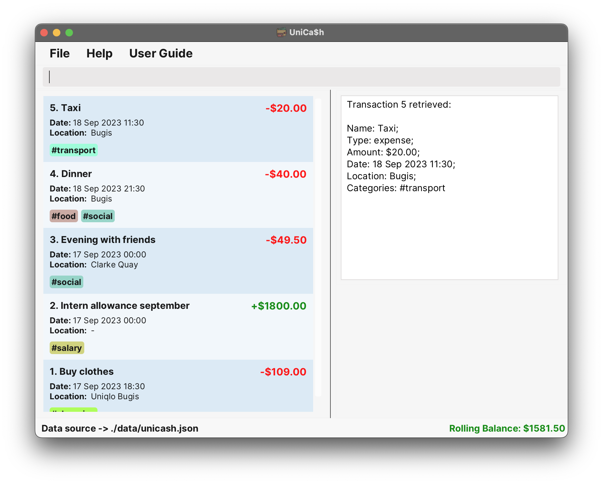

###### Example 2

> **Case**: Retrieve a transaction with the currently not visible but correctly specified `<INDEX>`.
>
> **Input**: `get 1`
>
> **Output**:
> ```
> Transaction 1 retrieved:
>
> Name: Buy clothes;
> Type: expense;
> Amount: $109.00;
> Date: 17 Sep 2023 18:30;
> Location: Uniqlo Bugis;
> Categories: #shopping
> ```
> Input:
> 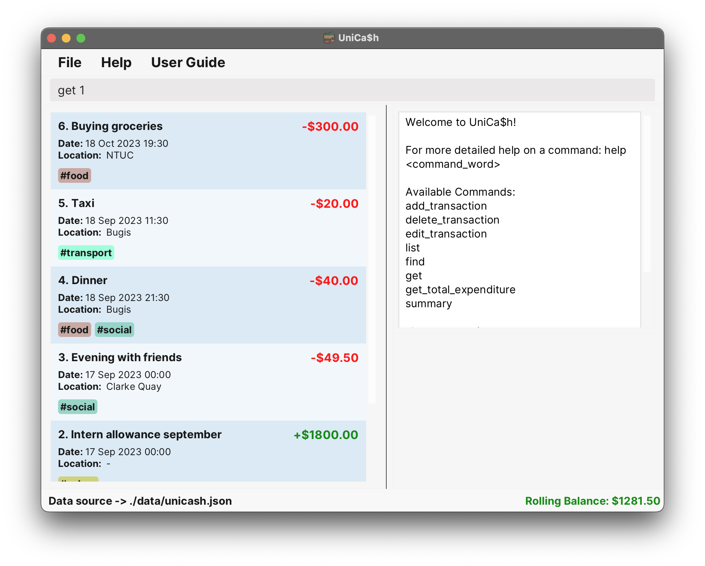
> Ouput:
> 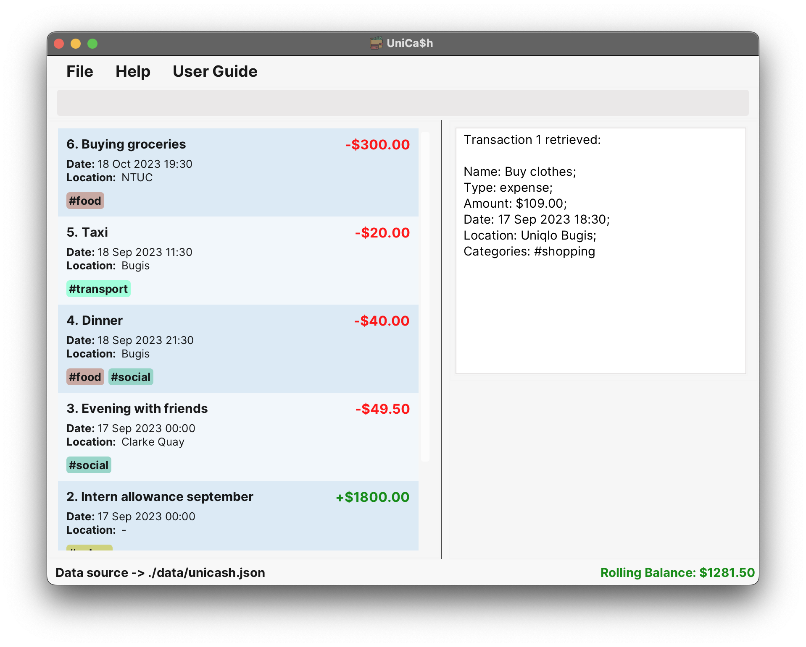

##### Failed Execution

###### Example 1

> **Case**: Missing compulsory fields.
>
> **Input**: `get`
>
> **Output**:
> ```
> Invalid command format! 
>
> get: Displays expanded details of a specific transaction.
>
> Argument: Index (must be a positive integer)
>
> Example: get 2
> ```
> 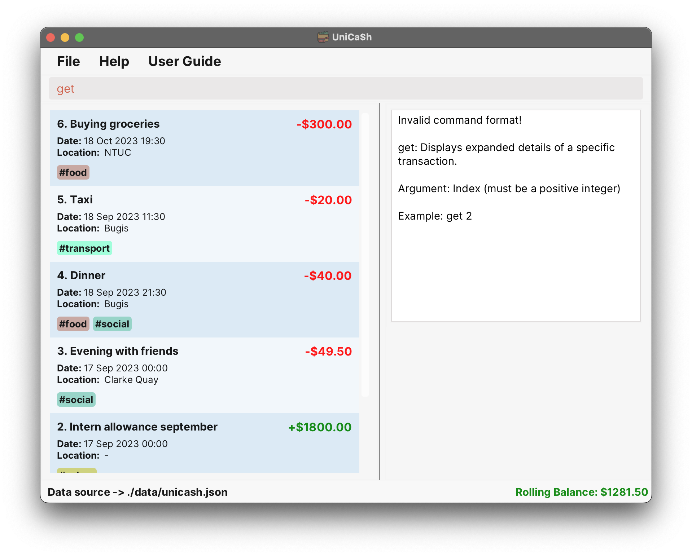

###### Example 2

> **Case**: Invalid `<INDEX>` provided
> (`<INDEX>` given as `10` given when only `5` transactions are presently displayed)
>
> **Input**: `get 10`
>
> **Output**:
> ```
> The transaction index provided is invalid
> ```
> 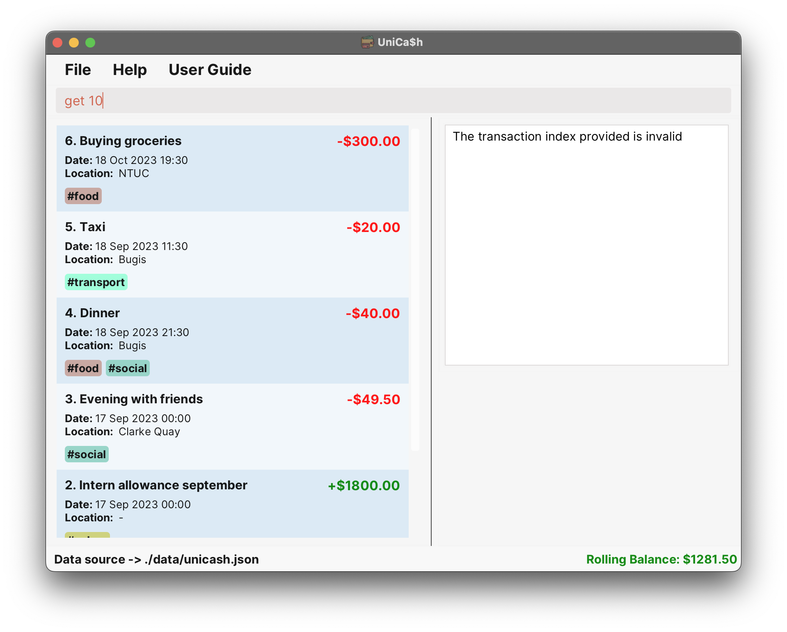

#### 4.1.7 ListCommand

#### 4.1.8 ClearTransactionsCommand

### 4.2 Financial Statistics Commands

#### 4.2.1 GetTotalExpenditureCommand

#### 4.2.2 SummaryCommand

### 4.3 General Utility Commands

#### 4.3.1 HelpCommand

#### 4.3.2 ResetCommand

#### 4.3.3 ExitCommand

## 5. Troubleshoot

## 6. Known Issues

## 7. FAQ

## 8. Acknowledgements

## 9. Glossary
