UniCa$h is a **is a desktop application used for university students who want to be more financially conscious,
optimized for use via a Command Line Interface** (CLI) while still having the benefits of a Graphical User Interface
(GUI). If you can type fast, UniCa$h can get your contact management tasks done faster than traditional GUI apps.



---

## Quick Start

### Installation

1. Ensure you have Java `11` or above installed in your Computer.

2. Download the latest `unicash.jar` from [GitHub](https://github.com/AY2324S1-CS2103-T16-3/tp/releases/tag/v1.3.1).

3. Copy the file to the folder you want to use as the _home folder_ for your UniCa$h.

4. Open a command terminal, `cd` into the folder you put the jar file in, and use the `java -jar unicash.jar` command to
   run the application.

   A GUI similar to the below should appear in a few seconds. Note how the app contains some sample data.<br>
   

5. Type the command in the command box and press `Enter` to execute it. e.g. typing **`help`** and pressing `Enter` will
   open the help window.

   To get started with UniCa$h, you can run the `add_transactions` command!

6. Refer to the [Features](#features) below for details of each command.

[//]: # (### 3.2 UI Layout)

UniCa$h is designed with users who prefer to use the keyboard in mind. Thus, almost all
user input is designed for CLI-type usage, i.e. text-based keyboard input, and UI elements are intended 
to supplement this main functionality.

When UniCa$h is first opened, it would look something like this:


By default, the Welcome Message will be displayed in the `Results Display`.
This message can also be invoked with the `help` command which will be explained
later on in this User Guide. Below are the main User Interface (UI) component features
we have implemented in UniCa$h.


Explained below are the main UI components. For the purposes of demonstrating certain UI features, certain commands
and inputs that are yet to be explained are mentioned here. However, at a later section of this User Guide,
all of these commands and inputs will be explained, feel free to refer to them at your discretion. _Where applicable,
consider those explanations as the single source of authority for those commands as the representation here is merely
for UI demonstration purposes only._


#### UniCa$h Main Window Components

- The Main Window in UniCa$h is resizeable, but has a minimum size enforced.
- The Menu bar contains the `File` and `Help` menus, of which `Help` can be opened with the
`F1` keyboard shortcut, which is also default to the original `AB-3`.


- _Note: On macOS, using UniCa$h in fullscreen will cause the Summary Window and Help Window to also
open in fullscreen, however this is an expected behaviour caused by macOS's window management style, and does not
cause any functional issues._ 

#### Command Box
- The `Command Box` is the primary means by which the user interacts actively with the application.
- The user types specific inputs into the `Command Box` and presses `ENTER` after typing to "communicate" with UniCa$h.
- The responses from UniCa$h for each input will be as defined in the subsection for each command in the later part of this User Guide
- Given that our application is targeted for users who prefer CLI-type text input interaction, the `Command Box`
is configured such that it can remember up to `10` latest user inputs. 
  - When a user presses `ENTER` on any input, the input is stored regardless of its validity.
  - These inputs can be traversed through with the `UP` and `DOWN` arrow keys on the keyboard.
  - Only the `10` most recent inputs are stored by the `Command Box`

  - _Note that due to a JavaFX built-in cursor control functionality (i.e. arrows keys can be used to navigate the menu bar),
  the mouse cursor being too close to the menu can occasionally trigger this functionality instead, simply move your
  mouse cursor away from the menu bar if this happens to alleviate the issue._
- At any point in time, the user can press the `ESC` to empty the current text field in the `Command Box` 

#### Transactions List
- Each transaction input by the user is displayed in the `Transactions List`. 
- The entire `Transactions List` will be displayed initially, however certain commands might limit this
listing, which can be reversed with the `list` command to show the entire list again.
- The `Transactions List` is ordered by the time at which the user inputs the transaction,
not the actual date and time associated with that particular transactions.
- Transactions added will immediately appear at the top of the `Transactions List`, and this is to
provide immediate response to the user as they will be able to see their most recently input 
transaction right away.
- The most recent transactions appear at the top of the `Transactions List`.

#### Transaction
- The `Transactions List` contains individual `Transactions` that look like this:


- **Transaction ID/Index/Number:** All terms used synonymously to refer to the number shown on the left partition of the blue box. Based
on the configuration of `Transactions List`, this number might change, and that is the intended effect, the use for which 
will be explained in the applicable commands, including `delete`, `edit` and `get` commands.
- **Transaction Name:** The name of the given transaction, shown on the right partition of the blue box.
- **Transaction Date:** The date assigned to the transaction, shown inside the pink box.
- **Transaction Location:** The location assigned to the transaction, shown inside the red box.
- **Transaction Categories:** The category/categories assigned to the transaction, shown inside the yellow box.
- **Transaction Amount:** The expense or income assigned to the transaction, shown inside the black box.
  - Expenses will be preceded with a `negative` sign and in red color, whereas incomes will not be preceded with any
  sign and displayed in green color. 
  - _This applies to the amount `0.00` as well, thus display color
is based only on transaction type`._


Note: Certain properties above (such as name, location, categories and amount)
are allowed values that exceed the UI's capacity to display them fully. For 
example, a transaction name that is too long will be shortened by the application,


This effect is accounted for as we do not wish to limit the user to arbitrary
lengths. Thus, the `get` command is available to retrieve the full, expanded details
of these transactions and display them in the `Results Display` component.

#### Results Display

- The `Results Display` is the primary means by which UniCa$h "responds" back
to the user via text output.
- The `Results Display` can be scrolled if the text output displayed is too long.

#### Data Source Indicator

- The `Data Source Indicator` shows the location of the current UniCa$h storage file.


#### Rolling Balance Indicator

- The `Rolling Balance Indicator` shows the net sum (i.e. `total income - total expense`) 
for the **currently displayed `Transactions List`**.
- For example, if the input `find n/friends` was used to find transactions whose names 
contain the keyword `friends`, the `Transactions List` would be updated to
only show matching transactions and likewise the `Rolling Balance Indicator` 
would reflect the net sum for these transactions.
- If the currently displayed `Transactions List` is the entire list (i.e. after using 
the `list` command), then the `Rolling Balance Indicator` would show the net sum of all 
transactions in UniCa$h. 
- _Note: Unlike the color of an amount of a transaction in `Transactions List`, the color of
the `Rolling Balance Indicator` will change based on whether the net sum is positive (green)
or negative (red) or zero (black)._

[//]: # ()

[//]: # (UI layout and description of what each section means)

### Command Breakdown

Commands in UniCa$h have the following structure:

`command_word (ARGUMENT) (PREFIXES)`

| command_word                                                                                                    | ARGUMENT                                                                                                      | PREFIXES                                                                                                               |
|-----------------------------------------------------------------------------------------------------------------|---------------------------------------------------------------------------------------------------------------|------------------------------------------------------------------------------------------------------------------------|
| Represents the command to run. May be referenced by alternative shorthands as described in each command section | Comes before all prefixes and often used to reference an index within the transactions list<br>Often optional | Often referred to as "Parameters"<br>Commonly used to specify various attributes/properties for a given `command_word` |

Prefixes are in the format: `prefix/Value`.

Each command will provide more details on their respective prefixes and argument (if any).

Prefixes have several variations with different notations:

1. Mandatory prefix: `prefix/Value`
2. Optional prefix: `[prefix/Value]`
3. Variadic (multiple) prefix: `prefix/Value...`
4. Variadic and optional prefix: `[prefix/Value]...`

The notation is standardized to make navigating this user guide easier.

[//]: # (### 3.4 Command Execution Tutorial)

[//]: # ()

[//]: # (Walkthrough of how to run a command with visual guides)

[//]: # (TODO Include details on each prefix type constraints)

---

## Features

### Features Overview

UniCa$h comprises of four primary feature groups:

- Transaction Management
    - Add Transaction (`add_transaction`)
    - Delete Transaction (`delete_transaction`)
    - Edit Transaction (`edit_transaction`)
    - List Transactions (`list`)
    - Get Transaction (`get`)
    - Find Transaction(s) (`find`)
    - Clear All Transactions (`clear_transactions`)
- Budget Management
    - Set Budget (`set_budget`)
    - Clear Budget (`clear_budget`)
    - Get Budget (`get_budget`)
- Financial Statistics
    - Get Total Expenditure (`get_total_expenditure`)
    - Summary Statistics (`summary`)
- General Utility
    - Show Help (`help`)
    - Reset UniCa$h (`reset_unicash`)
    - Exit UniCa$h (`exit`)

The instructions for the usage of each command within each feature group are elaborated in the sections below.

### Transaction Management

Transaction management allows users to directly manage their personal finances by adding, editing, deleting, and
finding transactions, among other management features.

#### Add Transaction

Adds a new `Transaction` to UniCa$h.

Command: `add_transaction n/NAME type/TYPE amt/AMOUNT [dt/DATETIME] [l/LOCATION] [c/CATEGORY]`

Command Words Accepted: `add_transaction`, `add`, `at`

Command Options:

| Option Name | Optional? | Purpose                                                                                       |
|-------------|-----------|-----------------------------------------------------------------------------------------------|
| n/          | No        | Name of the transaction.                                                                      |
| type/       | No        | Transaction type of transaction.<br/>Valid types are `income` and `expense`.                  |
| amt/        | No        | Monetary amount of transaction. Has to be a positive value.                                   |
| dt/         | Yes       | Date and time where transaction was made.<br/>Defaults to current date time if not specified. |
| l/          | Yes       | Location where transaction was made.<br/>Defaults to `''` if not specified.                   |
| c/          | Yes       | Category tagged to that transaction.<br/>No categories tagged if not specified.               |

Important notes:

1. There is a character limit for `Name` and `Location` set at up to 500 characters.
2. `Amount` entered has to be positive for both `income` and `expense`.
3. `Amount` is automatically rounded to 2 decimal places.
4. `UniqueCategoryList` enforces a unique (case-insensitive) constraint on `Category` it stores.
5. `UniqueCategoryList` enforces a max size of 5 `Category`
6. There is a character limit for `Category` set at up to 15 characters/
7. There is a limit of 100,000 transactions you can add to UniCa$h.

##### Successful Execution

###### Example 1

> **Case**: Add transaction with name, amount, type, datetime, location and a category.
>
> **Input**: `add_transaction n/Buying groceries type/expense amt/300 dt/18-08-2023 19:30 l/ntuc c/household`
>
> **Output**:
> ```
> New transaction added:
> 
> Name: Buying groceries;
> Type: expense;
> Amount: $300.00;
> Date: 18 Aug 2023 19:30;
> Location: ntuc;
> Categories: #household
> ```
>
> 

###### Example 2

> **Case**: Add transaction with name, amount and type.
>
> **Input**: `add_transaction n/Working type/income amt/8000`
>
> **Output**:
> ```
> New transaction added:
> 
> Name: Working;
> Type: income;
> Amount: $8000.00;
> Date: 28 Oct 2023 19:01;
> Location: -;
> Categories:
> ```
>
> 

##### Failed Execution

###### Example 1

> **Case**: Missing compulsory fields.
>
> **Input**: `add_transaction`
>
> **Output**:
> ```
> Invalid command format! 
>
> add_transaction: Adds a transaction to UniCa$h.
>
> Parameters: n/NAME type/TYPE amt/AMOUNT dt/DATETIME l/LOCATION [c/CATEGORY]...
>
> Example: add_transaction n/Buying groceries type/expense amt/300 dt/18-08-2023 19:30 l/ntuc c/household
> ```
> 

###### Example 2

> **Case**: Duplicate categories with valid compulsory fields.
>
> **Input**: `add_transaction n/Buying groceries type/expense amt/300 c/household c/household`
>
> **Output**:
> ```
> All categories must be case-insensitively unique, duplicate categories are not allowed.
> ```
> 

###### Example 3

> **Case**: More than 5 categories with valid compulsory fields.
>
> **Input
**: `add_transaction n/Buying groceries type/expense amt/300 c/household c/entertainment c/education c/fun c/school c/test`
>
> **Output**:
> ```
> There should only be a maximum of 5 unique categories.
> ```
> > 

###### Example 4

> **Case**: More than 100,000 transactions added.
>
> **Input**: `add n/test amt/300 type/expense`
>
> **Output**:
> ```
> UniCa$h supports up to a maximum of 100,000 transactions.
> ```
> > 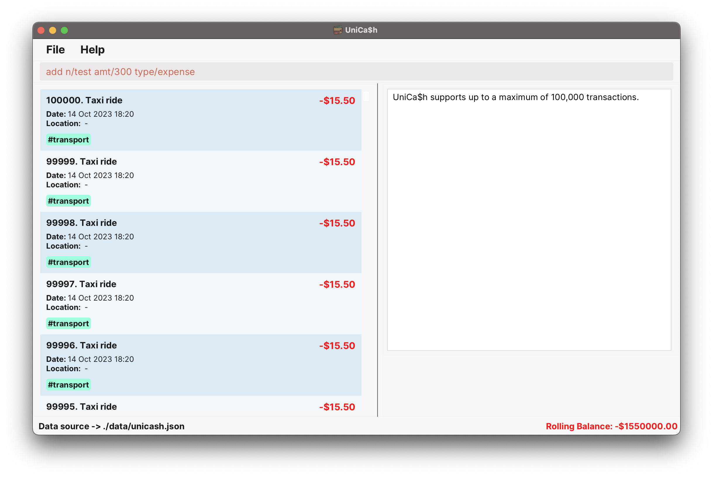

#### Edit Transaction

Edits an existing transaction in UniCa$h.

Command: `edit_transaction INDEX [n/NAME] [type/TYPE] [amt/AMOUNT] [dt/DATETIME] [l/LOCATION] [c/CATEGORY]`

Command Words Accepted: `edit_transaction`, `edit`, `et`

Command Options:

| Option Name | Optional? | Purpose                                                                                       | Remarks                                                                                                                                                        |
|-------------|-----------|-----------------------------------------------------------------------------------------------|----------------------------------------------------------------------------------------------------------------------------------------------------------------|
| INDEX       | No        | (One-based) index of the transaction to edit.                                                 | This ranges from 1 to the number of transactions saved                                                                                                         |
| n/          | Yes       | Name of the transaction.                                                                      | There is a 500-character limit                                                                                                                                 |
| type/       | Yes       | Transaction type of transaction.<br/>Valid types are `income` and `expense`.                  |                                                                                                                                                                |
| amt/        | Yes       | Monetary amount of transaction. Has to be a positive value.                                   | Automatically rounded to 2 decimal places.                                                                                                                     |
| dt/         | Yes       | Date and time where transaction was made.<br/>Defaults to current date time if not specified. | Can be in the `dd-MM-uuuu HH:mm` (e.g. 31-10-2023 12:00), `uuuu-MM-dd HH:mm` (e.g. 2023-10-31 22:59), or `dd MMM uuuu HH:mm` (e.g. 31 Oct 2023 22:59) formats. |
| l/          | Yes       | Location where transaction was made.<br/>Defaults to `'-'` if not specified.                  | There is a 500-character limit                                                                                                                                 |
| c/          | Yes       | Category tagged to that transaction.<br/>No categories tagged if not specified.               | There is a 15-character limit.<br/>`Category` entered will be converted and stored as all lowercase.<br/>Each transaction can have at most 5 categories.       |

Important notes:

1. While all options besides `INDEX` are optional, **you must specify at least one field** you wish to edit (
   i.e. `Name`, `Type`, `Amount`, `Datetime`, `Location`, or `Category`).
2. You must provide a non-empty value for the `Name`, `Type`, and `Amount` fields if you wish to edit them; they cannot
   be left empty.
3. The `INDEX` option must be specified first. The order in which you specify the other options does not matter.

##### Successful Execution

###### Example 1

> **Case**: Edit an existing transaction's name, amount, type, datetime, location and categories.
>
> **Input**: `edit_transaction 5 n/Tuition Income type/income amt/1000 dt/2023-10-31 10:00 l/John home c/tuition`
>
> **Output**:
> ```
> Edited Transaction:
> 
> Name: Tuition Income;
> Type: income;
> Amount: $1000.00;
> Date: 31 Oct 2023 10:00;
> Location: John home;
> Categories: #tuition
> ```
>
> 

###### Example 2

> **Case**: Edit an existing transaction's datetime and amount only.
>
> **Input**: `edit_transaction 5 dt/31 Oct 2023 12:00 amt/1200`
>
> **Output**:
> ```
> Edited Transaction:
> 
> Name: Tuition Income;
> Type: income;
> Amount: $1200.00;
> Date: 31 Oct 2023 12:00;
> Location: John home;
> Categories: #tuition
> ```
>
> 

###### Example 3

> **Case**: Edit an existing transaction's location and categories to default.
>
> **Input**: `edit_transaction 5 l/ c/`
>
> **Output**:
> ```
> Edited Transaction:
>
> Name: Tuition Income;
> Type: income;
> Amount: $1200.00;
> Date: 31 Oct 2023 12:00;
> Location: -;
> Categories:
> ```
>
> 

##### Failed Execution

###### Example 1

> **Case**: No attributes to edit
>
> **Input**: `edit_transaction 5`
>
> **Output**:
> ```
> At least one field to edit must be provided.
> ```
>
> 

###### Example 2

> **Case**: No index provided
>
> **Input**: `edit_transaction n/Donation`
>
> **Output**:
> ```
> Invalid command format! 
> 
> edit_transaction: Edits the details of the transaction identified by the index number used in the displayed transaction list.
> 
> Argument: Index (must be a positive integer)
> 
> Parameters: [n/Name] [type/Type] [amt/Amount] [dt/DateTime] [l/Location] [c/Category]...
> 
> Example: edit_transaction 1 n/Buying groceries type/expense amt/300 dt/18-08-2023 19:30 l/NTUC c/Food
> ```
>
> 

###### Example 3

> **Case**: Attempting to leave compulsory field (E.g. `name`) blank
>
> **Input**: `edit_transaction 5 n/`
>
> **Output**:
> ```
> Names should only contain alphanumeric characters, spaces, (, ), _, @, -, #, &, ., and ',', up to 500 characters and it should not be blank
> ```
>
> 

###### Example 4

> **Case**: There are only 5 transactions, but the user tries to edit expense 6
>
> **Input**: `edit_transaction 6 n/Dog food`
>
> **Output**:
> ```
> The transaction index provided is invalid
> ```
>
> 

###### Example 5

> **Case**: Wrong input format (e.g. `Datetime` is not specified in any of the accepted formats)
>
> **Input**: `edit_transaction 5 dt/23 March 2023 8:15pm`
>
> **Output**:
> ```
> DateTime should be in either of the following formats: 
> 1. dd-MM-uuuu HH:mm
> 2. uuuu-MM-dd HH:mm
> 3. dd MMM uuuu HH:mm
> ```
>
> 

#### Delete Transaction

Deletes a `Transaction` from UniCa$h.

Command: `delete_transaction INDEX`

Command Words Accepted: `delete_transaction`, `delete`, `del`

Command Argument: `<INDEX>` is the displayed transaction index
of the transaction to be deleted, as shown in the `Transactions List`.

| Arguments | Optional? | Purpose                                            |
|-----------|-----------|----------------------------------------------------|
| `<INDEX>` | No        | Transaction index of the transaction to be deleted |

Important notes:

1. The `delete_transaction` command word is case-insensitive, thus `DELETE_TRANSACTION` is
   considered an equivalent command word.

2. `<INDEX>` must be a positive integer, i.e. a number greater than 0.

3. `<INDEX>` must be equal to or smaller than 2,147,483,647 which is the `Integer.MAX_VALUE` provided by Java 11.

4. `<INDEX>` must be equal to or smaller than the largest displayed transaction index
   of all transactions as shown in the `Transactions List`. Thus, even if there are `100` total transactions but only
   `20` of those transactions are displayed in the current `Transactions List`, the maximum `INDEX` allowed
   would be `20`

5. Given `3.` and `4.`, the maximum allowed `<INDEX>` is the smaller value of the two.

##### Successful Execution

###### Example 1

> **Case**: Delete a transaction with the correctly specified `<INDEX>`.
>
> **Input**: `delete_transaction 1`
>
> **Output**:
> ```
> Deleted Transaction:
>
> Name: Evening with friends;
> Type: expense;
> Amount: $49.50;
> Date: 17 Sep 2023 00:00;
> Location: Clarke Quay;
> Categories: #social
> ```
> Input:
> 
> Output:
> 

###### Example 2

> **Case**: Delete a transaction with the currently not visible but correctly specified `<INDEX>`.
>
> **Input**: `delete_transaction 1`
>
> **Output**:
> ```
> Deleted Transaction:
> 
> Name: Lunch at McDonalds;
> Type: expense;
> Amount: $17.40;
> Date: 15 Sep 2023 11:00;
> Location: Clementi Mall;
> Categories: #food
> ```
> Input:
> 
> Ouput:
> 

##### Failed Execution

###### Example 1

> **Case**: Missing compulsory fields.
>
> **Input**: `delete_transaction`
>
> **Output**:
> ```
> Invalid command format! 
>
> delete_transaction: Deletes the transaction identified by the index number used in the displayed transaction list.
>
> Argument: Index (must be a positive integer)
>
> Example: delete_transaction 1
> ```
> 

###### Example 2

> **Case**: Invalid `<INDEX>` provided
> (`<INDEX>` given as `10` given when only `5` transactions are presently displayed)
>
> **Input**: `delete_transaction 10`
>
> **Output**:
> ```
> The transaction index provided is invalid
> ```
> 

#### Get Transaction

Retrieves a `Transaction` from UniCa$h.

Command: `get <INDEX>`

Command Words Accepted: `get`, `g`

Command Argument: `<INDEX>` is the displayed transaction index
of the transaction to be retrieved, as shown in the `Transactions List`.

| Arguments | Optional? | Purpose                                              |
|-----------|-----------|------------------------------------------------------|
| `<INDEX>` | No        | Transaction index of the transaction to be retrieved |

Important notes:

1. The `get` command word is case-insensitive, thus `GET` is
   considered an equivalent command word.

2. `<INDEX>` must be a positive integer, i.e. a number greater than 0.

3. `<INDEX>` must be equal to or smaller than 2,147,483,647 which is the `Integer.MAX_VALUE` provided by Java 11.

4. `<INDEX>` must be equal to or smaller than the largest displayed transaction index
   of all transactions as shown in the `Transactions List`. Thus, even if there are `100` total transactions but only
   `20` of those transactions are displayed in the current `Transactions List`, the maximum `INDEX` allowed
   would be `20`

5. Given `3.` and `4.`, the maximum allowed `<INDEX>` is the smaller value of the two.

##### Successful Execution

###### Example 1

> **Case**: Retrieve a transaction with the correctly specified `<INDEX>`.
>
> **Input**: `get 5`
>
> **Output**:
> ```
> Transaction 5 retrieved:
> 
> Name: Taxi;
> Type: expense;
> Amount: $20.00;
> Date: 18 Sep 2023 11:30;
> Location: Bugis;
> Categories: #transport
> ```
> Input:
> 
> Ouput:
> 

###### Example 2

> **Case**: Retrieve a transaction with the currently not visible but correctly specified `<INDEX>`.
>
> **Input**: `get 1`
>
> **Output**:
> ```
> Transaction 1 retrieved:
>
> Name: Buy clothes;
> Type: expense;
> Amount: $109.00;
> Date: 17 Sep 2023 18:30;
> Location: Uniqlo Bugis;
> Categories: #shopping
> ```
> Input:
> 
> Ouput:
> 

##### Failed Execution

###### Example 1

> **Case**: Missing compulsory fields.
>
> **Input**: `get`
>
> **Output**:
> ```
> Invalid command format! 
>
> get: Displays expanded details of a specific transaction.
>
> Argument: Index (must be a positive integer)
>
> Example: get 2
> ```
> 

###### Example 2

> **Case**: Invalid `<INDEX>` provided
>
> **Context**: `10` given as `<INDEX>` when only `5` transactions are presently displayed.
>
> **Input**: `get 10`
>
> **Output**:
> ```
> The transaction index provided is invalid
> ```
> 

#### Find Transaction(s)

Finds a `Transaction` in UniCa$h.

Command: `find [n/NAME] [l/LOCATION] [c/CATEGORY]`

Command Words Accepted: `find`, `search`, `f`

Command Argument: `<INDEX>` is the displayed transaction index
of the transaction to be retrieved, as shown in the `Transactions List`.

Command Options:

| Option Name      | Optional?       | Purpose                                                      |
|------------------|-----------------|--------------------------------------------------------------|
| n/               | Yes*            | Search keyword for the name of a transaction.                |
| l/               | Yes*            | Search keyword for the location of a transaction.            |
| c/               | Yes*            | Search keyword for a category tagged to a transaction        |
| Any of the above | Min. one option | At least one option must be specified for the `find` command |

Important notes:
1. The `find` command word is case-insensitive, thus `FIND` is
   considered an equivalent command word.

2. *While each option is considered Optional, at least one option must be specified in total

3. All keywords specified must match in order for a transaction to be displayed.
4. Only one instance of each option can be specified, i.e. `/n Friends n/Dinner` is invalid as the name 
option is specified more than once.
5. For each keyword, a full substring match is required, thus `find n/Lunch with friends` with search for transactions
whose name contains the String `Lunch with friends` and not `Lunch`, `with`, and `friends` separately. However, an 
exact match is not required as a transaction with the name `Lunch with friends outside` contains the above substring
and therefore it will be flagged as a match.

##### Successful Execution

###### Example 1

> **Case**: Retrieve a transaction with the correctly specified options.
>
> **Input**: `find n/friends`
>
> **Output**:
> ```
> 
> 1 Transactions listed!
> 
> ```
> Input:
> 
> 
> Output:
> 

##### Failed Execution

###### Example 1

> **Case**: Command entered with no parameters
>
> **Input**: `find`
>
> **Output**:
> ```
> Invalid command format! 
> 
> find, search, f: Finds all transactions whose properties match all of thespecified keywords (case-insensitive) and displays them as a list with index numbers.
> 
> Only one keyword can be specified for each property and at least one keyword must be provided in total.
> 
> Parameters: [n/Name] [l/Location] [c/Category]
> 
> Example: find, search, f n/Buying groceries type/expense amt/300 dt/18-08-2023 19:30 l/NTUC c/Food
> 
> ```
> Output:
> 
> 

#### List Transactions
Shows the list of all transactions in UniCa$h.

Command: `list`

Command Words Accepted: `list`, `ls`

#### Clear Transactions
Clears all transactions in UniCa$h.

Command: `clear_transactions`

Command Words Accepted: `clear_transactions`

### Budget Management

The budget serves as a warning system to notify users when their expenses for the given interval exceeds their preset
amount.

> 💡 NOTE: For this team project, we have opted to simplify the budgeting feature by limiting the user to a single budget
> at a time that can be configured for different intervals and amounts.

#### Set Budget

Sets the user's budget on UniCa$h to be a given amount and within a given interval.

Command: `set_budget amt/AMOUNT interval/INTERVAL`

Command Words Accepted: `set_budget`, `sb`, `budget`

Command Options:

| Option Name | Optional? | Purpose                                                         |
|-------------|-----------|-----------------------------------------------------------------|
| amt/        | No        | Monetary amount of budget. Has to be a positive value.          |
| interval/   | No        | Interval of budget, can be of values "day", "week", or "month". |

Important notes:

1. `Amount` entered has to be positive for any `interval` value.
2. `Amount` is automatically rounded to 2 decimal places.
3. `Amount` must be less than or equal to `2,147,483,647`.
4. `Interval` must be of values "day", "week", or "month".

##### Successful Execution

###### Example 1

> **Case**: Set budget of $600 for every month.
>
> **Input**: `set_budget amt/600 interval/month`
>
> **Output**:
> ```
> New budget added:
>
> Amount: $600.00;
> Interval: month
> ```
>
> 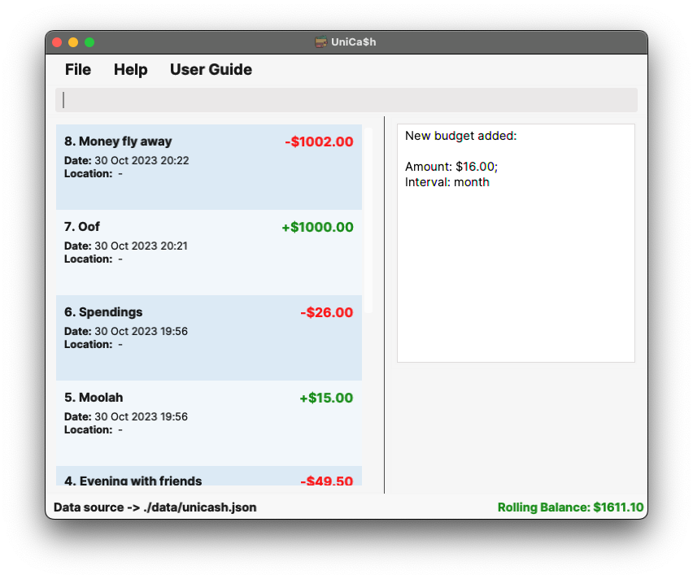

##### Failed Execution

###### Example 1

> **Case**: Missing amount.
>
> **Input**: `set_budget interval/month`
>
> **Output**:
> ```
> Invalid command format! 
>
> set_budget: Sets the user's budget on UniCa$h.
>
> Parameters: amt/Amount interval/Interval
>
> Example: set_budget amt/300 interval/day
> ```
>
> 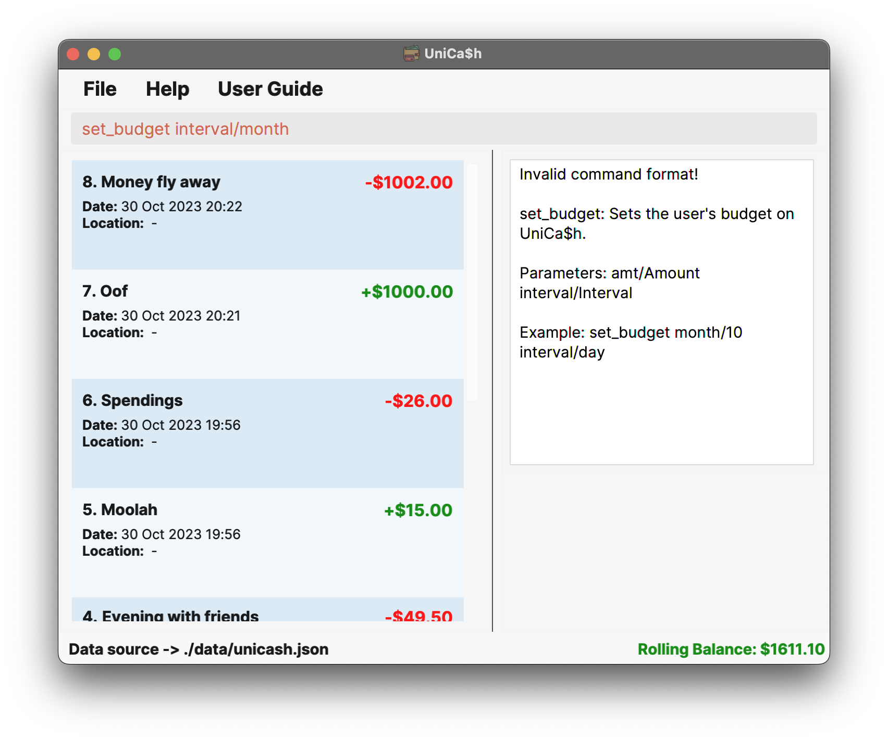

###### Example 2

> **Case**: Missing interval.
>
> **Input**: `set_budget amt/600`
>
> **Output**:
> ```
> Invalid command format! 
>
> set_budget: Sets the user's budget on UniCa$h.
>
> Parameters: amt/Amount interval/Interval
>
> Example: set_budget amt/300 interval/day
> ```
>
> 

###### Example 3

> **Case**: No fields.
>
> **Input**: `set_budget`
>
> **Output**:
> ```
> Invalid command format! 
>
> set_budget: Sets the user's budget on UniCa$h.
>
> Parameters: amt/Amount interval/Interval
>
> Example: set_budget amt/300 interval/day
> ```
>
> 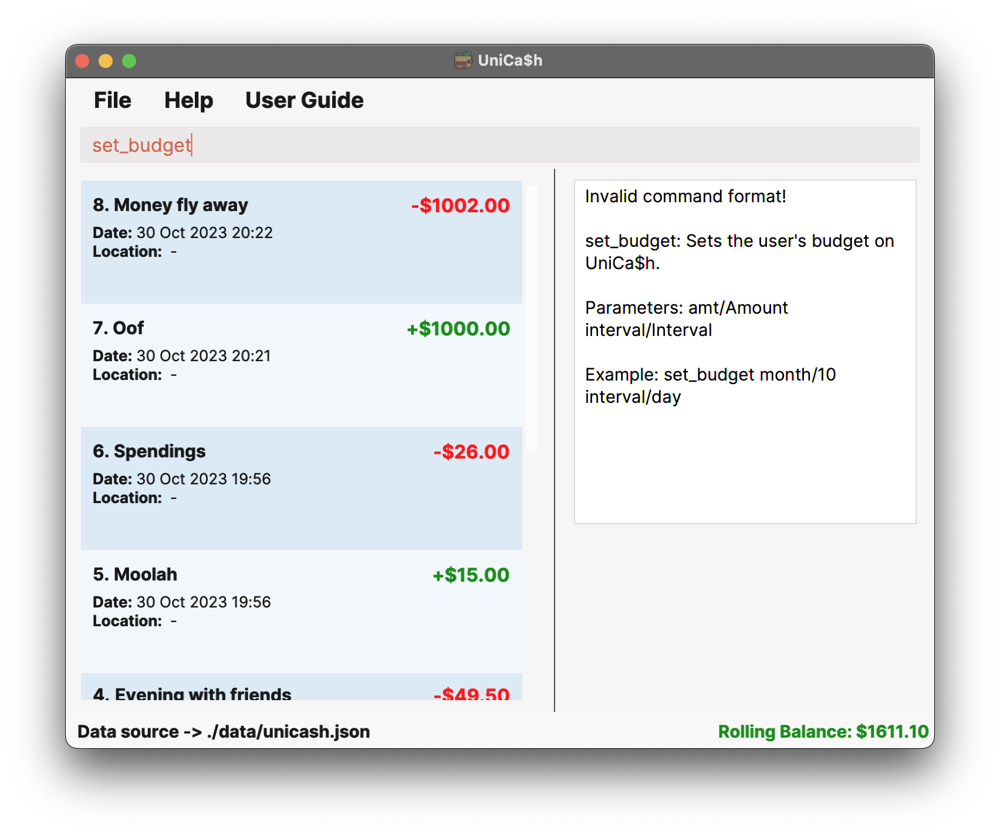

###### Example 4

> **Case**: Negative amount.
>
> **Input**: `set_budget amt/-123 interval/day`
>
> **Output**:
> ```
> Amounts must be within range of [0, 2,147,483,647] and either start with $ or nothing at all
> ```
>
> 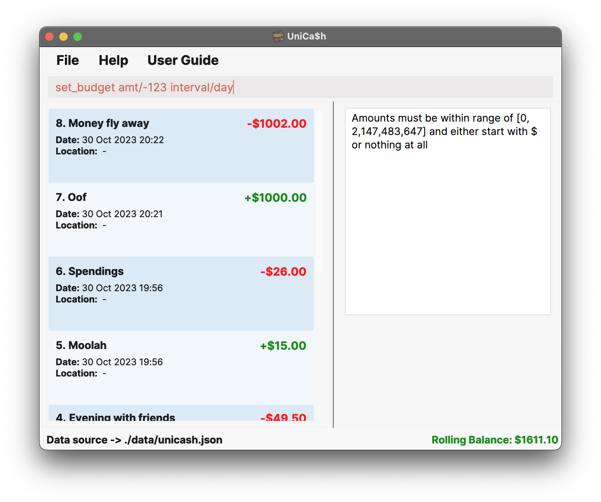

###### Example 5

> **Case**: Invalid interval value.
>
> **Input**: `set_budget amt/600 interval/hi`
>
> **Output**:
> ```
> Interval value must be one of the following: day, week, month
> ```
>
> 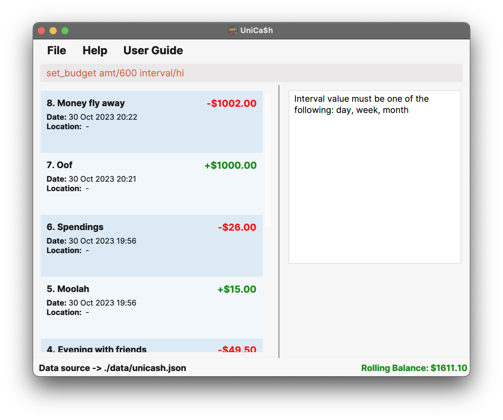

#### Clear Budget

Clears the user's budget set in UniCa$h. If no budget is set yet, the user is prompted to set one first instead.

Command: `clear_budget`

Command Words Accepted: `clear_budget`, `cb`

Command Options: This command does not take in any arguments and will not process any arguments.

##### Successful Execution

###### Example 1

> **Case**: Clear user set budget.
>
> **Input**: `clear_budget`
>
> **Output**:
> ```
> Budget cleared.
> ```
>
> 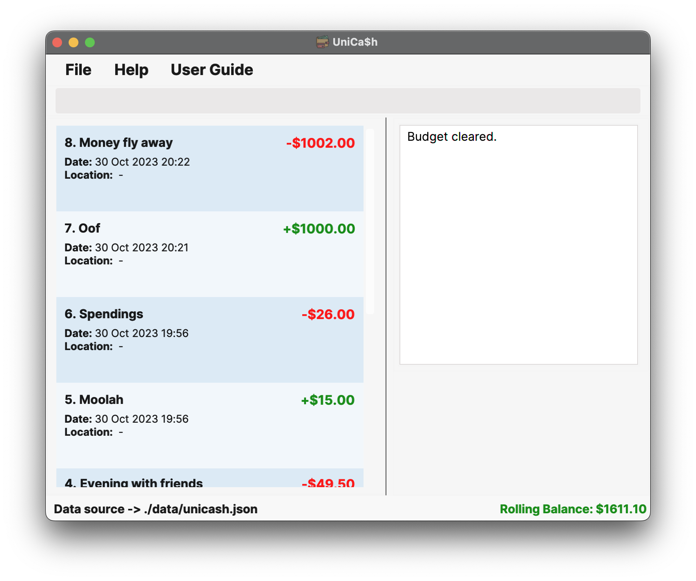

###### Example 2

> **Case**: Clear without set budget.
>
> **Input**: `clear_budget`
>
> **Output**:
> ```
> No budget to clear.
>
> Consider using set_budget amt/Amount interval/Interval first!
> ```
>
> 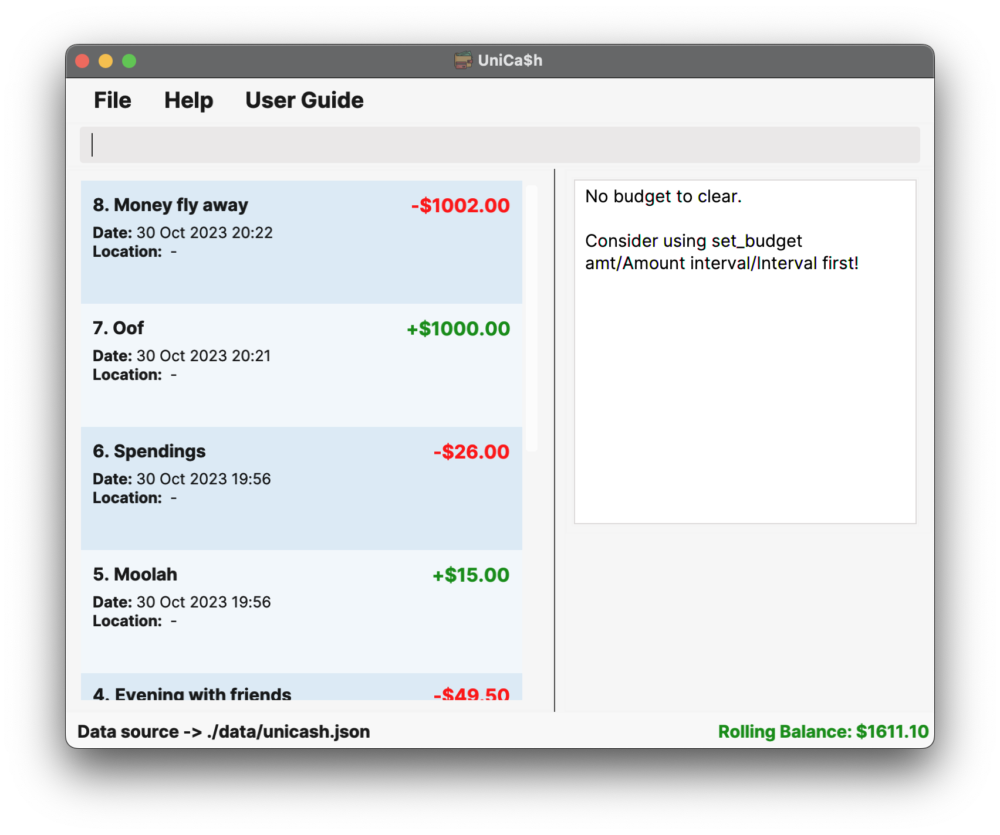

#### Get Budget

Retrieves the set budget and the spending over the given interval. The usage is calculated from the list of filtered
transactions so to view the budget remainder across expense transactions, use the `list` command first.

If no budget has been set, the user will be prompted to set one first instead.

The user's spending is calculated by: `budget - interval expenses`.

Command: `get_budget`

Command Options: This command does not take in any arguments and will not process any arguments.

##### Successful Execution

###### Example 1

> **Case**: Get user's set budget and spending remainder.
>
> **Input**: `get_budget`
>
> **Output**:
> ```
> Monthly budget of $600.00
>
> Net amount of $585.00
> ```
>
> 

###### Example 2

> **Case**: Get budget without budget set.
>
> **Input**: `get_budget`
>
> **Output**:
> ```
> No budget set. Use set_budget amt/Amount interval/Interval
> ```
>
> 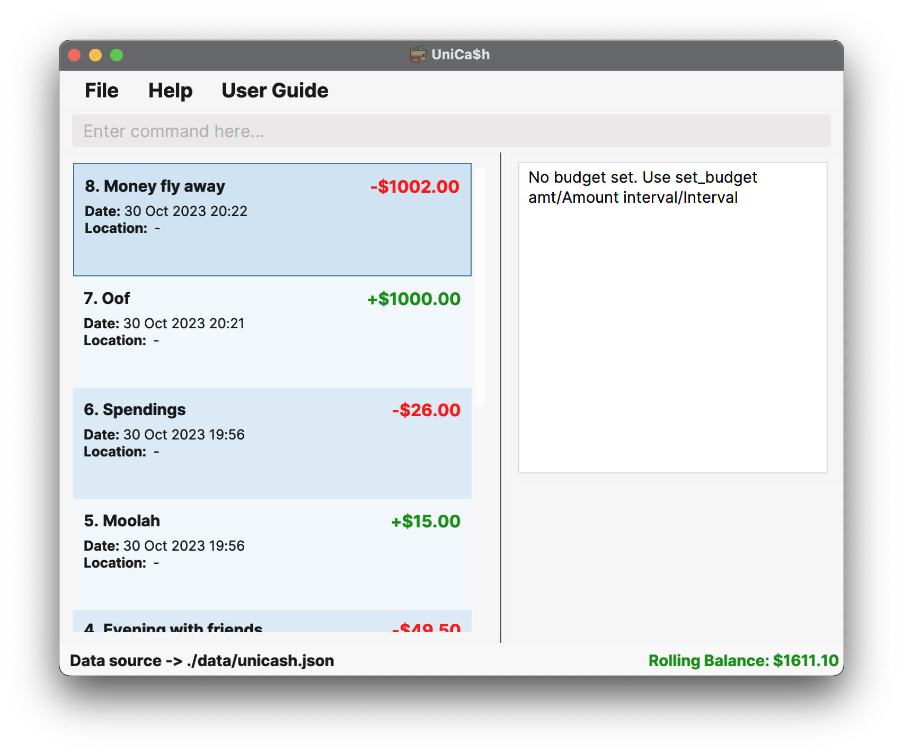

[//]: # (TODO: maybe add failed case if more arguments provided)

### Financial Statistics

#### Get Total Expenditure

Retrieves the total expenditure by month with optional filters for category and year. Also filters the transactions
by the given month, year, and category.

Use `list` to view all transactions again.

Command: `get_total_expenditure month/Month [c/Category] [year/Year]`

Command Words Accepted: `get_total_expenditure`, `get_total_exp`, `gte`

Command Options:

| Option Name | Optional? | Purpose                                                                               |
|-------------|-----------|---------------------------------------------------------------------------------------|
| month/      | No        | Month to calculate the total expenditure.                                             |
| c/          | Yes       | Category of expenditure to retrieve.<br>Defaults to all categories if not provided.   |
| year/       | Yes       | Year to calculate the total expenditure.<br>Defaults to current year if not provided. |

Important notes:

1. `Month` must be an integer between 1 and 12 (inclusive).
2. `Year` must be an integer greater than or equal to 1920.
3. `Category` cannot be blank, must be alphanumeric, and can only contain up to 15 characters.
4. `Category` is case-insensitive.

##### Successful Execution

###### Example 1

> Case: Get total expenditure with month only.
>
> Input: `get_total_expenditure month/10`
>
> Output:
> ```
> Your total expenditure in October 2023 was $1028.00
> ```
>
> 

###### Example 2

> Case: Get total expenditure with month and year.
>
> Input: `get_total_expenditure month/10 year/2023`
>
> Output:
> ```
> Your total expenditure in October 2023 was $1028.00
> ```
>
> 

###### Example 3

> Case: Get total expenditure with month and category.
>
> Input: `get_total_expenditure month/9 c/social`
>
> Output:
> ```
> Your total expenditure in September 2023 for "social" was $49.50
> ```
>
> 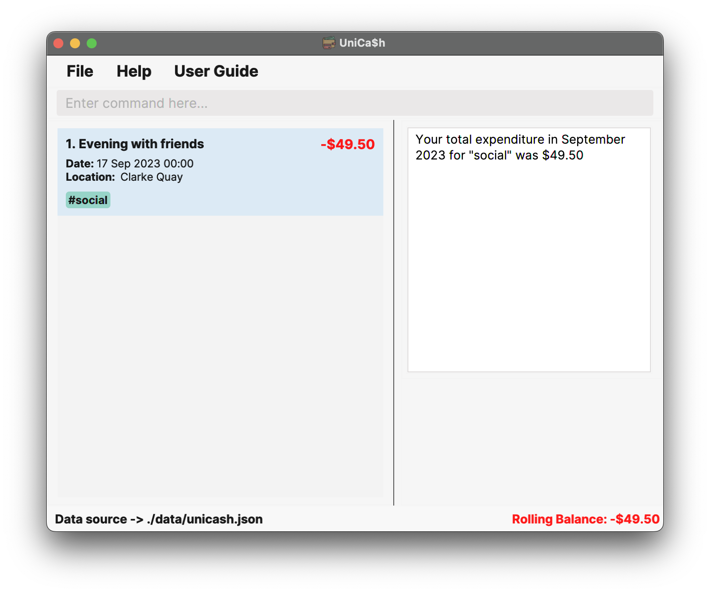

###### Example 4

> Case: Get total expenditure with month, category, and year.
>
> Input: `get_total_expenditure month/9 c/shopping year/2023`
>
> Output:
> ```
> Your total expenditure in September 2023 for "shopping" was $109.00
> ```
>
>
> 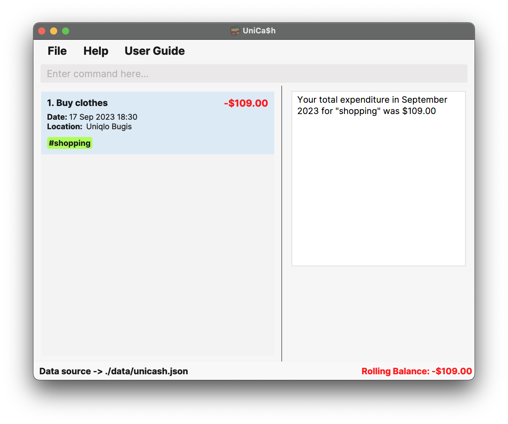

###### Example 5

> Case: Get total expenditure but no matches.
>
> Input: `get_total_expenditure month/1`
>
> Output:
> ```
> Your total expenditure in September 2023 for "shopping" was $109.00
> ```
>
> 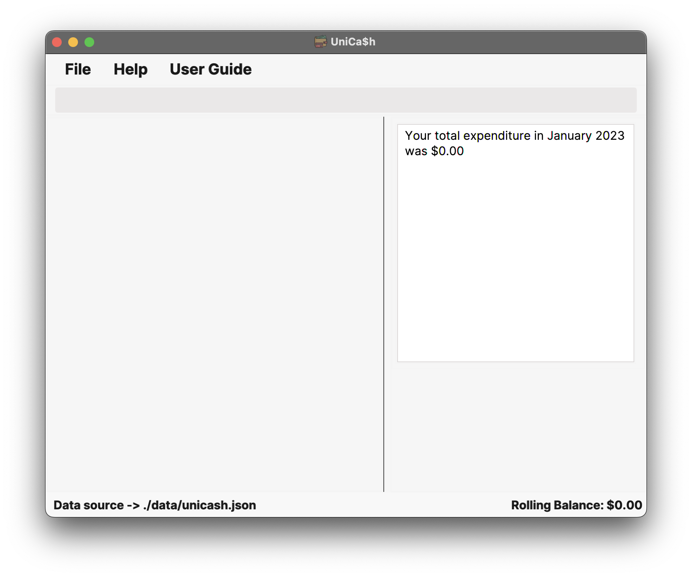

##### Failed Execution

###### Example 1

> Case: No month provided.
>
> Input: `get_total_expenditure`
>
> Output:
> ```
> Invalid command format! 
>
> get_total_expenditure: Retrieves the total expenditure by month with optional filters for category and year.
>
> Parameters: month/Month [c/Category] [year/Year]
>
> Example: get_total_expenditure month/10 c/Food year/2006
> ```
>
> 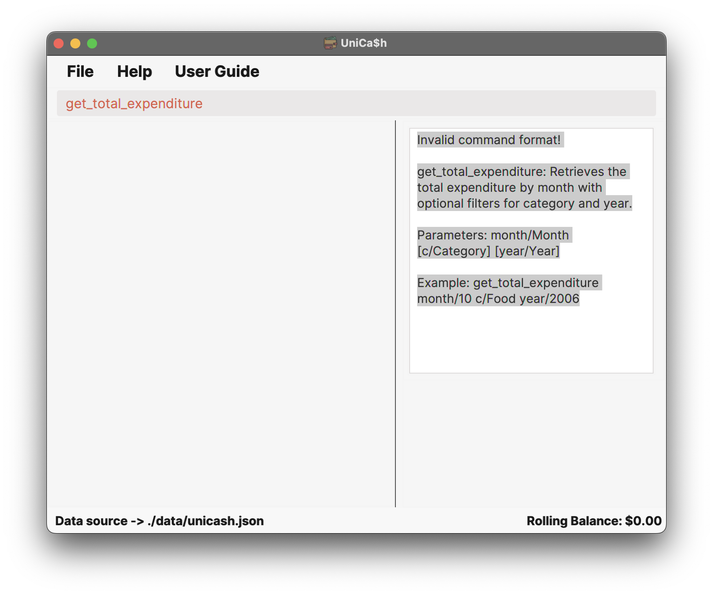

###### Example 2

> Case: Negative month.
>
> Input: `get_total_expenditure month/-10`
>
> Output:
> ```
> Month must be between 1 and 12 (inclusive).
> ```
>
> 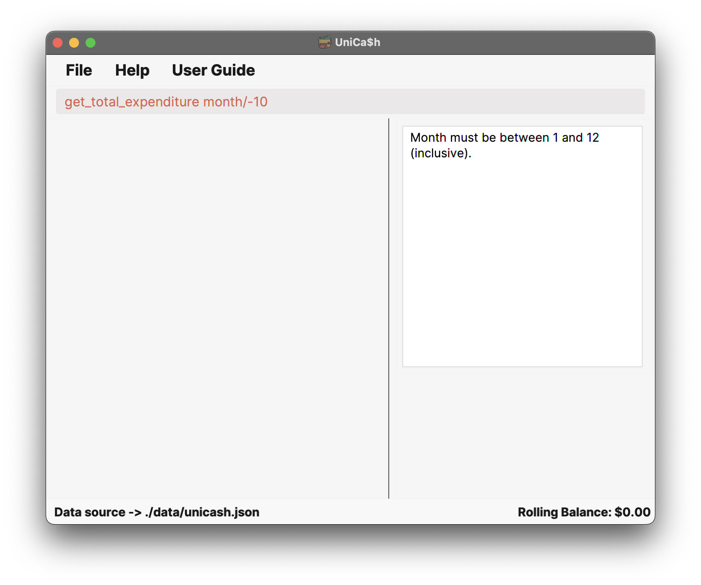

###### Example 3

> Case: Month greater than 12.
>
> Input: `get_total_expenditure month/14`
>
> Output:
> ```
> Month must be between 1 and 12 (inclusive).
> ```
>
> 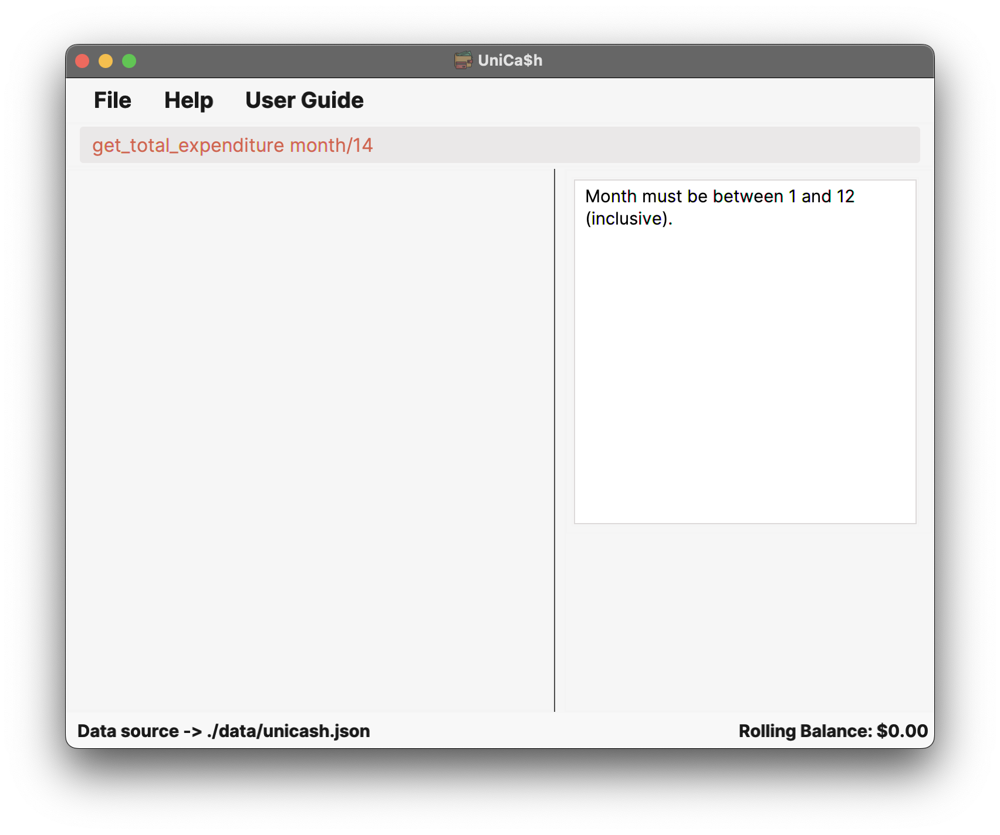

###### Example 4

> Case: Month is not an integer.
>
> Input: `get_total_expenditure month/hi`
>
> Output:
> ```
> Invalid month value, must be an integer!
> ```
>
> 

###### Example 5

> Case: Year is less than 1920.
>
> Input: `get_total_expenditure month/9 year/1800`
>
> Output:
> ```
> Year must be after 1920.
> ```
>
> 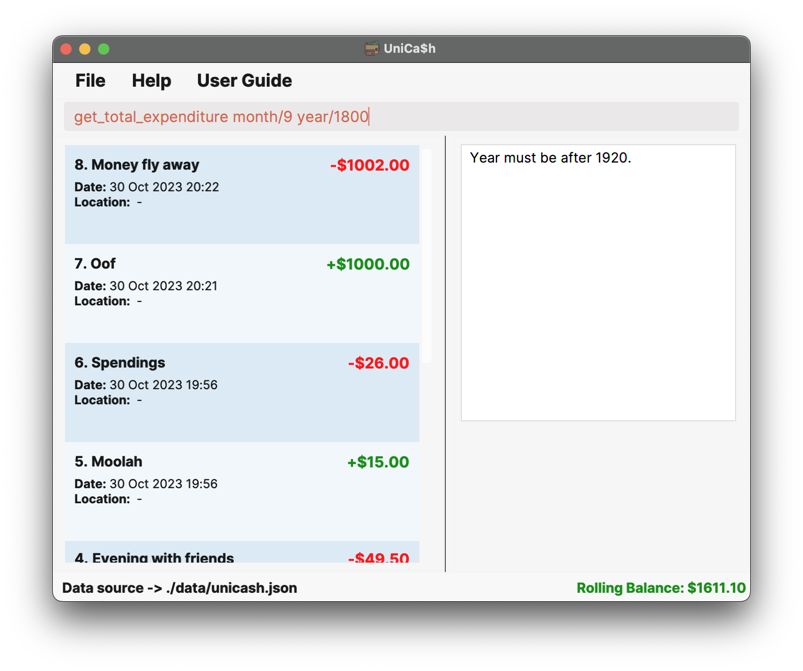

###### Example 6

> Case: Year is not an integer.
>
> Input: `get_total_expenditure month/9 year/hi`
>
> Output:
> ```
> Invalid year value, must be an integer!
> ```
>
> 

###### Example 7

> Case: Category contains non-alphanumeric characters.
>
> Input: `get_total_expenditure month/9 c/@123`
>
> Output:
> ```
> Category names should be alphanumeric and up to 15 characters long.
> ```
>
> 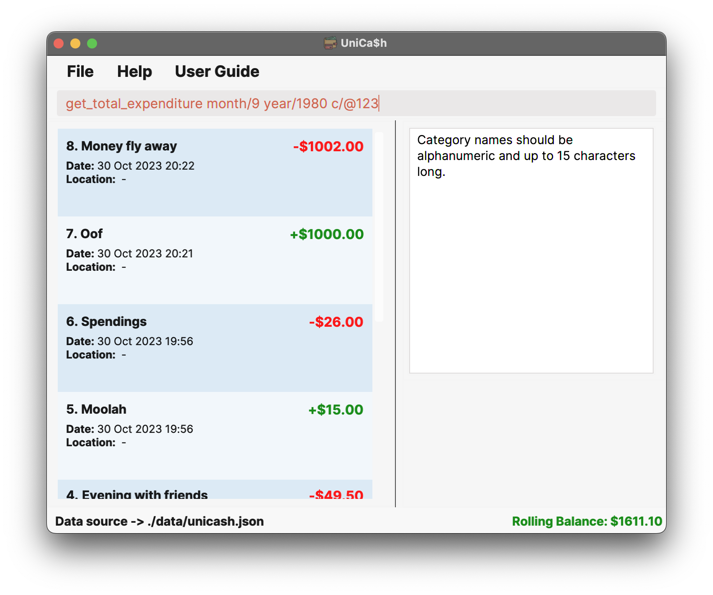

###### Example 8

> Case: Category length is greater than 15.
>
> Input: `get_total_expenditure month/9 c/abcdefghijklmnopqrs`
>
> Output:
> ```
> Category names should be alphanumeric and up to 15 characters long.
> ```
>
> 

#### Summary Statistics

Displays a summary of the expenses saved in UniCa$h.

Command: `summary`

Command Words Accepted: `summary`

Important notes:

1. Expected Behaviour: The summary of expenses is a pop-up window. If there are no expenses saved in UniCa$h, the pop-up
   window will not appear. Do note that the summary window will remain open should you decide to remove all expenses
   after it is opened, until you manually close it.
2. When making changes to your transactions in UniCa$h, the plots in the summary window will automatically update to
   reflect your modifications.
3. The pie chart showcases the **top 10 expense categories** based on their respective amounts.
4. The line chart exclusively showcases expenses **from the past one year**, according to the system's clock.

##### Successful Execution

###### Example 1

> **Case**: There are expenses saved in UniCa$h
>
> **Input**: `summary`
>
> **Output**:
>
> The output displayed in the main window is:
> ```
> Opened UniCa$h summary window.
> ```
>
> 
>
> Here is what the summary pop-up window looks like:
>
> 

###### Example 2

> **Case**: All expenses are removed from UniCa$h while the summary window was open
>
> **Input**: `clear_transactions`
>
> **Output**: Here is what the summary window will look like
>
> 

###### Example 3

> **Case**: There are no expenses saved in UniCa$h, and the summary window is closed.
>
> **Input**: `summary`
>
> **Output**:
> ```
> You have no expenses to summarize.
> ```
> 
> Note: The summary pop-up window does not appear.

### General Utility

#### Help

Get help for UniCa$h.

Command: `help COMMAND_WORD`

Command Words Accepted: `help`, `h`

Command Argument: `COMMAND_WORD` is the command to get help for. If no
argument is specified, a general help message is shown as well as a pop up
containing a link to our User Guide.

> To get a list of `COMMAND_WORD`, do `help` with no arguments

##### Successful Execution

###### Example 1

> **Case**: Get general help.
>
> **Input**: `help`
>
> **Output**:
> ```
> Welcome to UniCa$h!
> 
> For more detailed help on a command: help COMMAND_WORD
>
> Available Commands:
> add
> delete
> edit
> list
> find
> get
> get_total_expenditure
> summary
> set_budget
> get_budget
>
> clear_budget
> clear
> reset
>
> help
> exit
> ```
>
> The following output is shown as well as the popup.
> 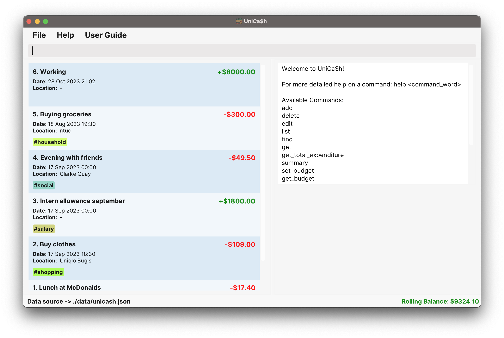
> 

###### Example 2

> **Case**: Get general for a specific command.
>
> **Input**: `help add_transaction`
>
> **Output**:
> ```
> add_transaction: Adds a transaction to UniCa$h.
>
> Parameters: n/Name type/Type amt/Amount [dt/DateTime] [l/Location] [c/Category]...
>
> Example: add_transaction n/Buying groceries type/expense amt/300 dt/18-08-2023 19:30 l/NTUC c/Food
> ```
>
> 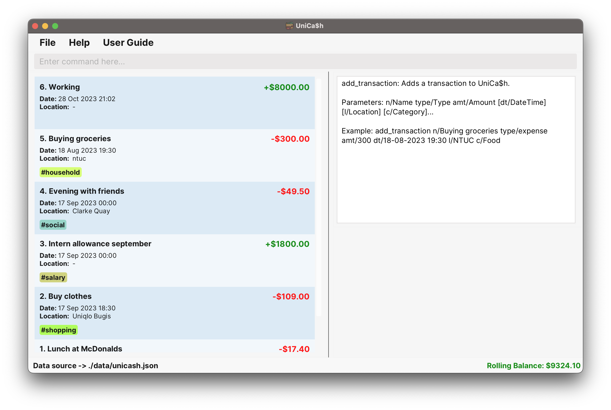

##### Failed Execution

##### Example 1

> **Case**: Get help for an unknown command.
>
> **Input**: `help foo`
>
> **Output**:
> ```
> Unknown command
>
> help: Shows UniCa$h general usage instructions and specific command usage by specifying the command word.
>
> Argument: Command word specified must be a valid command word present in the help command
>
> Example: help add_transaction
> ```
>
> 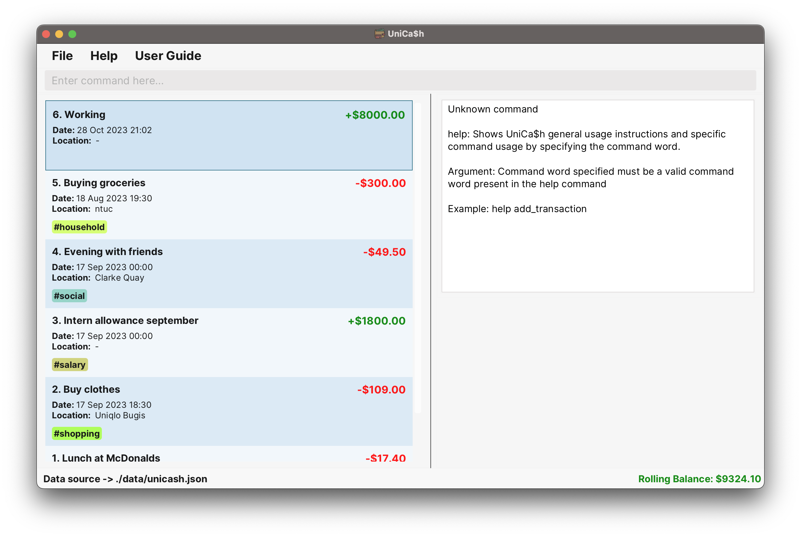

#### Reset UniCa$h

#### Exit UniCa$h

### Summary

| Action                      | Format, Examples                                                                                      |
|-----------------------------|-------------------------------------------------------------------------------------------------------|
| **Add Transaction**         | `add_transaction n/Name type/Type amt/Amount [dt/Datetime] [l/Location] [c/Category]...`              |
| **Delete Transaction**      | `delete_transaction INDEX`                                                                            |                                                                                                                                                                                                                       |
| **Delete All Transactions** | `clear_transactions`                                                                                  |
| **Edit Transaction**        | `edit_transaction INDEX [n/Name] [type/Type] [amt/Amount] [dt/Datetime] [l/Location] [c/Category]...` |
| **List All Transactions**   | `list`                                                                                                |
| **Find Transaction(s)**     | `find [n/Name] [c/Category] [l/Location]`                                                             |
| **Get Total Expenditure**   | `get_total_expenditure month/Month [c/Category] [year/Year]`                                          |
| **Summary Statistics**      | `summary`                                                                                             |
| **Set Budget**              | `set_budget amt/Amount interval/Interval`                                                             |
| **Clear Budget**            | `clear_budget`                                                                                        |
| **Get Budget**              | `get_budget`                                                                                          |

[//]: # (## Troubleshoot)

---

## Known Issues

1. Hard to see scrollbar

---

## FAQ

**Q**: How do I transfer my data to another Computer?

**A**: Install the app in the other computer and overwrite the empty data file it creates with the file that contains
the data of your previous UniCa$h home folder.

---

## Acknowledgements

This project is based on the AddressBook-Level3 project created by the [SE-EDU initiative](https://se-education.org).

---

## Terminology

| Term        | Meaning                                                                                            |
|-------------|----------------------------------------------------------------------------------------------------|
| Transaction | Represents both an expense or an income. Expenses cause a net loss while incomes cause a net gain. |
